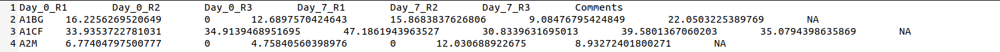
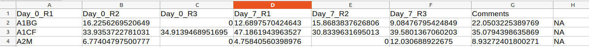

```{r setup, include=FALSE}
# options(width = 60);
knitr::opts_chunk$set(
  echo = TRUE,        # Print the code
  eval = TRUE,       # Do not run command lines
  message = FALSE,    # Print messages
  prompt = FALSE,     # Do not display prompt
  comment = NA,       # No comments on this section
  warning = TRUE      # Display warnings
);

#base::library(package = "dplyr")
```

<style type="text/css">
summary {
  display: list-item;
}
details:hover {
  cursor: pointer
}
body {
  text-align: justify
}
.column-left{
  float: left;
  width: 47%;
  text-align: left;
}
.column-right{
  float: right;
  width: 47%;
  text-align: left;
}
</style>


# Purpose

At the end of this session, you will be able to:

1. Load a table in R
1. Identify formatting issues
1. Load a table in R, accounting for local number formats (commas, spaces, ...)
1. Load a table in R, accounting for irregular string formats (random capitalization, invisible characters, ...)
1. Load a table in R, accounting for unreadable formats (excel, compression, ...)
1. Load a table in R, accounting for formatting issues (missing headers, free comments column, ...)
1. Save a table in multiple formats (csv, tsv, ...)
1. Save and export your working session

During this session, we will use rnaseq count tables displaying 
gene expression during Epithelial-Mesenchymal transition.

# Different table formats
We can often get an indication on table's format thanks to the extentionof the file:

* .tsv: tabulation separated values (columns are separated by tabulations).
* .csv: comma separated values (columns are separated by comma in English, or by semicolon in French).
* .xlsx or .xls: excel format.
* .zip: compressed table in zip format (example file.tsv.zip).

Be carreful this is not an absolute rule, and a .txt file could be a table too!

# Loading a well-formatted table

## Usage of [`utils::read.table`](https://www.rdocumentation.org/packages/utils/versions/3.6.2/topics/read.table)

To load a table in memory, one can use the function [`read.table`](https://www.rdocumentation.org/packages/utils/versions/3.6.2/topics/read.table) from the package [`utils`](https://www.rdocumentation.org/packages/utils/versions/3.6.2).
Remember, while specifying the package name is facultative, it remains very important when you want to share, reproduce, and make your work accessible. These are the keys of the [FAIR principles](https://fr.wikipedia.org/wiki/Fair_data).


```{r}
counts <- utils::read.table(file="EMT_counts_data.txt")
```

Let's see the content of the table, using the function [`head`](https://www.rdocumentation.org/packages/utils/versions/3.6.2/topics/head)
from package [`utils`](https://www.rdocumentation.org/packages/utils/versions/3.6.2).

```{r, eval=FALSE}
utils::head(x = counts)
```

```{r, echo=FALSE, results='asis'}
knitr::kable(
  x = utils::head(x=counts),
  caption = "First lines of the wrongly parsed table"
)
```

Oh, there is a problem here...
Help me identify all our issues here.

<details>

<summary>List of issues</summary>

1. Columns are not separated correctly
1. Header is not recognized
1. Row names are considered as a column

</details>
<br />

To find a solution to that, don't forget to use the help ([`help()`](https://www.rdocumentation.org/packages/utils/versions/3.6.2/topics/help) function or the help pane of RStudio).

<details>

<summary>Solution</summary>

```{r}
counts <- utils::read.table(
    file="EMT_counts_data.txt",
    header=TRUE,                # set the first line as column names
    sep=",",                    # set the character to separate columns
    row.names=1                 # set the first column as row names
)
```

Then we use the [`head`](https://www.rdocumentation.org/packages/utils/versions/3.6.2/topics/head)
function again...

```{r, eval=FALSE}
utils::head(x = counts)
```

```{r, echo=FALSE, results='asis'}
knitr::kable(
  x = utils::head(x=counts),
  caption = "First lines of the correctly parsed table"
)
```

It looks just as it shoud!

</details>
<br />

## Checking content and format of a table

We should have a table full of numbers. Let's check the type of information
stored in our table.

First, we can check the type of our table thanks to the function [`class`](https://www.rdocumentation.org/packages/base/versions/3.6.2/topics/class) from the package [`base`](https://www.rdocucentation.org/packages/base/versions/3.6.2/).

```{r}
base::class(counts)
```

Our table is a data frame.  
Remember: a dataframe can has columns of different types but all values of a column have the same type.  
So we just need to check the type of each columns.
To apply the function [`class`](https://www.rdocumentation.org/packages/base/versions/3.6.2/topics/class) several time (here on each column), we can use the function [`sapply`](https://www.rdocumentation.org/packages/base/versions/3.6.2/topics/lapply) from the package [`base`](https://www.rdocucentation.org/packages/base/versions/3.6.2/).

```{r}
# X correspond to our counts table
# FUN correspond to the function to apply
base::sapply(X=counts, FUN=base::class)
```

We only have numbers, it seems that we can start to work further with this table.

## Dealing with (zip) compression

[Zip](https://en.wikipedia.org/wiki/ZIP_(file_format))
compression is quite common, alongside with [gzip](https://en.wikipedia.org/wiki/Gzip)
and [bz2](https://en.wikipedia.org/wiki/Bzip2).

One can handle these compression formats easily with
the function [`unzip`](https://www.rdocumentation.org/packages/utils/versions/3.6.2/topics/unzip),
or any of the functions presented in the [documentation](https://www.rdocumentation.org/packages/base/versions/3.6.2/topics/connections)
about compression formats.

```{r}
counts <- utils::read.table(
    file=utils::unzip(zipfile="EMT_counts_data.txt.zip"),
    header=TRUE,
    sep=",",
    row.names=1
)
```

Let's see the content of the table, using the function [`head`](https://www.rdocumentation.org/packages/utils/versions/3.6.2/topics/head).

```{r, eval=FALSE}
utils::head(x = counts)
```

```{r, echo=FALSE, results='asis'}
knitr::kable(
  x = utils::head(x=counts),
  col.names = base::gsub(pattern="_", replacement=" ", base::colnames(counts)),
  caption = "First lines of the parsed table"
)
```

One does not have to unzip a table *before* loading it into R. This saves
disk space, but consumes a bit more memory.

# Loading an oddly formatted table

Usually, a table provided by a person not familiar with informatics won't
fit. Using Excel ou LibreOffice will add lots of unnecessary information.
Using a Windows or a Mac will add strange values to the end of lines, format
commas and quotes differently, etc.

The file `EMT_counts_data_manip2_odds.tsv` is a good starting example. Let's try to load it!

## Dealing with wrong number of columns

```{r, eval=FALSE}
counts <- utils::read.table(
    file="EMT_counts_data_manip2_odds.tsv",
    sep="\t"
)
```

What happens with this command line?

This is due to missing fields at line 10.
There may be more of these missing fields, we cannot know
how many missing fields are in this file. However, we can try
"fix" these missing fields, by adding blanks.


```{r}
counts <- utils::read.table(
    file="EMT_counts_data_manip2_odds.tsv",
    sep="\t",
    fill=TRUE
)
```

Let's see the content of the table, using the function [`head`](https://www.rdocumentation.org/packages/utils/versions/3.6.2/topics/head).

```{r, eval=FALSE}
utils::head(x = counts)
```

```{r, echo=FALSE, results='asis'}
knitr::kable(
  x = utils::head(x=counts),
  col.names = base::colnames(counts),
  caption = "First lines of the parsed table with column separators and right number of columns"
)
```

The table looks correct. The last field, a commantary,
may have been broken by the previous person editing that
count file.

However, it is not possible to know if a column has been
shifted, mixed, or deleted. I strongly encourage you to
contact the author of a file with missing fields.

## First line as column

One can tell R that the first line should be considered as
a header with the argument in the function [`read.table`](https://www.rdocumentation.org/packages/utils/versions/3.6.2/topics/read.table).

```{r}
counts <- utils::read.table(
    file="EMT_counts_data_manip2_odds.tsv",
    sep="\t",
    fill=TRUE,
    header=TRUE
)
```

Let's see the content of the table, using the function [`head`](https://www.rdocumentation.org/packages/utils/versions/3.6.2/topics/head).

```{r, eval=FALSE}
utils::head(x = counts)
```

```{r, echo=FALSE, results='asis'}
knitr::kable(
  x = utils::head(x=counts),
  col.names = base::colnames(counts),
  caption = "First lines of the parsed table with headers"
)
```

The table looks even better now!

## Dealing with characters and numbers

To load this table, we just added blank and set the header, so easy!
Why does this section say it would be hard?

Let's check the column types:

```{r}
base::sapply(X=counts, FUN=base::class)
```

We can try to cast the characters into numbers.
In this context, `casting` means changing the type
of a variable. Here, we cant to change the type of
each cells in the dataframe from `characters` to
something like `numeric`.

This can be done with the function [`as.numeric`](https://www.rdocumentation.org/packages/base/versions/3.6.2/topics/numeric)
from the [`base`](https://www.rdocumentation.org/packages/base/versions/3.6.2/)
package.  
Thanks to the help of [`as.numeric`](https://www.rdocumentation.org/packages/base/versions/3.6.2/topics/numeric), we can see that this function works on values or on vectors, so we can apply it on each column where a column corresponds to a vector.

```{r}
counts <- base::sapply(X=counts, FUN=base::as.numeric)
```

There are a lot of warning messages. What changed?

Let's see the content of the table, using the function [`head`](https://www.rdocumentation.org/packages/utils/versions/3.6.2/topics/head).

```{r, eval=FALSE}
utils::head(x = counts)
```

```{r, echo=FALSE, results='asis'}
knitr::kable(
  x = utils::head(x=counts),
  col.names = base::colnames(counts),
  caption = "First lines of the wrongly casted table"
)
```

Okay, it does not work here (it replaces all values by [`NA`](https://www.rdocumentation.org/packages/base/versions/3.6.2/topics/NA)), so there is another underlying problem.

Let's try to cast only a cell:
```{r, eval=TRUE}
counts <- utils::read.table(
    file="EMT_counts_data_manip2_odds.tsv",
    sep="\t",
    fill=TRUE,
    header=TRUE
)
print(counts[1,2])
base::as.numeric(counts[1,2])
```

It does not work neither, so the problem comes from inside cells.  
Do you see what is wrong?

## Dealing with commas and floating points

The author of this file uses a French number formats.  
The option `dec` allows to indicate the character to use for float numbers.

```{r}
counts <- utils::read.table(
    file = "EMT_counts_data_manip2_odds.tsv",
    sep = "\t",
    fill = TRUE,
    header = TRUE,
    dec = ","
)
```


Let's see the content of the table, using the function [`head`](https://www.rdocumentation.org/packages/utils/versions/3.6.2/topics/head).

```{r, eval=FALSE}
utils::head(x = counts)
```

```{r, echo=FALSE, results='asis'}
knitr::kable(
  x = utils::head(x=counts),
  col.names = base::colnames(counts),
  caption = "First lines of the parsed table with floating **points**"
)
```
It looks good again!  
How about the type of the columns:

```{r}
base::sapply(X=counts, FUN=base::class)
```

Commas have been identified as decimal separator,
it solved the problem.

## Remove invisible characters

Excel and LibreOffice often include spaces when user clicks
on a cell. Fortunately, we can remove these spaces with the option `strip.white`.

```{r}
counts <- utils::read.table(
    file="EMT_counts_data_manip2_odds.tsv",
    sep="\t",
    fill = TRUE,
    header=TRUE,
    dec=",",
    strip.white=TRUE
)
```

Note that this is the default behavior for numeric fields.

## The first column is a row name

Giving R information about column name(s) and row name(s) is
a good practice to help it understand the content of our table.  
We can set the row names with the option `row.name`.

```{r}
# row.name=1 means the first column has to be considered as row names
# row.name="Gene_Symbol" means the column named "Gene_Symbol" has to be considered as row names
counts <- utils::read.table(
    file="EMT_counts_data_manip2_odds.tsv",
    sep="\t",
    header=TRUE,
    dec=",",
    fill=TRUE,
    strip.white=TRUE,
    row.name="Gene_Symbol"
)
```

Let's see the content of the table, using the function [`head`](https://www.rdocumentation.org/packages/utils/versions/3.6.2/topics/head).

```{r, eval=FALSE}
utils::head(x = counts)
```

```{r, echo=FALSE, results='asis'}
knitr::kable(
  x = utils::head(x=counts),
  col.names = base::colnames(counts),
  caption = "First lines of the parsed table with correct row names"
)
```

The table looks even better now.

## Dealing with empty cells and [`<NA>`](https://www.rdocumentation.org/packages/base/versions/3.6.2/topics/NA)

Keep empty value is not a good pratice. If there is no value, set them as `NA`, there are some functions related to `NA` values.
We can provide a list of values (like empty values, "NA", "na", etc) to convert into `NA`.

```{r}
counts <- utils::read.table(
    file="EMT_counts_data_manip2_odds.tsv",
    sep="\t",
    fill=TRUE,
    header=TRUE,
    dec=",",
    strip.white=TRUE,
    row.name="Gene_Symbol",
    na.strings=c("", "NA") # convert empty and "NA" (word) values into NA values
)
```

Let's see the content of the table, using the function [`head`](https://www.rdocumentation.org/packages/utils/versions/3.6.2/topics/head).

```{r, eval=FALSE}
utils::head(x = counts)
```

```{r, echo=FALSE, results='asis'}
knitr::kable(
  x = utils::head(x=counts),
  col.names = base::colnames(counts),
  caption = "First lines of the parsed table with empty cells identified"
)
```

# Loading Excel table

Loading Excel sheets require a special package named [`readxl`](https://www.rdocumentation.org/packages/readxl/versions/1.4.3/)
and its dedicated function [`read_excel`](https://www.rdocumentation.org/packages/readxl/versions/1.4.3/topics/read_excel).  

> Note: you can install this package with `install.packages("readxl")`.

```{r}
counts <- readxl::read_xlsx(
    path="EMT_counts_data_manip2.xlsx"
)
```
Ohoh, we have several warnings that are saying we have the word "Important!" in some cells, instead of logical values (TRUE or FALSE) expected by R.

These are warnings and not errors so we can see the content of the table, using the function [`head`](https://www.rdocumentation.org/packages/utils/versions/3.6.2/topics/head).

```{r, eval=FALSE}
utils::head(x = counts)
```

```{r, echo=FALSE, results='asis'}
knitr::kable(
  x = utils::head(x=counts),
  col.names = base::colnames(counts),
  caption = "First lines of the parsed Excel table"
)

```

Your turn now:

Exercise 1: Explore the function [`read_excel`](https://www.rdocumentation.org/packages/readxl/versions/1.4.3/topics/read_excel) 
and search how to make the column `Gene_Symbol` as 
[`row.names`](https://www.rdocumentation.org/packages/base/versions/3.6.2/topics/row.names), remove whitespaces etc.  

Exercise 2. Use the functions [`sapply`](https://www.rdocumentation.org/packages/base/versions/3.6.2/topics/lapply) 
and [`class`](https://www.rdocumentation.org/packages/base/versions/3.6.2/topics/class) 
from [`base`](https://www.rdocumentation.org/packages/base/versions/3.6.2/) 
package to ensure R knows that numbers *are* numbers, characters *are* characters and logical *are* logical.  
And if not, correct that.


<details>

<summary> Solution for the Exercise 1 </summary>

```{r, warning=FALSE, message=FALSE}
counts <- readxl::read_xlsx(
    path="EMT_counts_data_manip2.xlsx",
    col_names=TRUE, # set first line as column names
    trim_ws=TRUE) # remove whitespace
```

```{r, eval=FALSE}
utils::head(x = counts)
```

```{r, echo=FALSE, results='asis'}
knitr::kable(
  x = utils::head(x=counts),
  col.names = base::colnames(counts),
  caption = "First lines of the parsed table with correct types"
)
```

There is not option to set row names, so we have to do it "by hand" with the function [`row.names`](https://www.rdocumentation.org/packages/base/versions/3.6.2/topics/row.names).

```{r}
base::row.names(counts) <- counts$Gene_Symbol
```

Ohoh (the return), there is a warning. It says that the output of the function [`read_excel`](https://www.rdocumentation.org/packages/readxl/versions/1.4.3/topics/read_excel) is a tibble (a specific kind of table), and that is confirmed by the documentation of the funtion.  
This is a warning so this command line is working... but this is deprecated and will not work in the futur.  
So it is better to avoid obsolete work for the sustainability of the code.  
For that, we have to convert our table into a data frame thanks to the function [`as.data.frame`](https://www.rdocumentation.org/packages/base/versions/3.6.2/topics/as.data.frame), before to add row names.
```{r, warning=FALSE, message=FALSE}
#read table
counts <- readxl::read_xlsx(
    path="EMT_counts_data_manip2.xlsx",
    col_names=TRUE, # set first line as column names
    trim_ws=TRUE) # remove whitespace
#convert tibble into data frame
counts <- base::as.data.frame(counts)
#set row names
base::row.names(counts) <- counts$Gene_Symbol
#delete Gene_Symbol column
counts$Gene_Symbol <- NULL
```
```{r, eval=FALSE}
#watch the result
utils::head(x = counts)
```

```{r, echo=FALSE, results='asis'}
knitr::kable(
  x = utils::head(x=counts),
  col.names = base::colnames(counts),
  caption = "First lines of the parsed table with correct column names, row names and without whitespaces"
)
```

</details>
<br />

<details>
<summary> Solution for the Exercise 2 </summary>

```{r}
base::sapply(X=counts, FUN=base::class)
```
Some columns are "character" and "logical", we have to correct that with the option `col_types`.

```{r, warning=FALSE}
counts <- readxl::read_xlsx(
    path="EMT_counts_data_manip2.xlsx",
    col_names=TRUE,
    trim_ws=TRUE,
    col_types=c("text", "numeric", "numeric", "numeric", "numeric", "numeric", "numeric", "text") # set the type of each column
)
```
If you have a warning like "*Warning: Coercing text to numeric in D2 / R2C4: '12.689757042464343'*", is not really important. It's just saying that it's casting the character value '12.689757042464343' into numeric. Just like we want!
```{r}
#redo formating of the exercice 1
counts <- base::as.data.frame(counts)
base::row.names(counts) <- counts$Gene_Symbol
counts$Gene_Symbol <- NULL
```

```{r, eval=FALSE}
#watch the result
utils::head(x = counts)
```

```{r, echo=FALSE, results='asis'}
knitr::kable(
  x = utils::head(x=counts),
  col.names = base::colnames(counts),
  caption = "First lines of the parsed table with correct types"
)
```

```{r}
#check type
base::sapply(X=counts, FUN=base::class)
```
Perfect!
</details>
<br />

# Save table

## Save table as a tsv/csv file

To save a table in a file on your computer, you can use the function [`write.table`](https://www.rdocumentation.org/packages/utils/versions/3.6.2/topics/write.table) from the package [`utils`](https://www.rdocumentation.org/packages/utils/versions/3.6.2).

```{r}
write.table(x = counts,            # table to save
            file = "counts_well_formatted.tsv",   # name of the file
            quote = FALSE,         # TRUE means to add double quotes around character values
            sep = "\t",            # tabulation separation
            na = "NA",             # replace NA values by NA as a word
            dec = ".",             # set the decimal separator as "."
            row.names = TRUE,      # save row names in the file
            col.names = TRUE)      # save column names in the file

```
Check the result (open the file with an editor of text or excel):  

  



Erf, there is no column name for row names, so all column names are shifted to the left.

How can we correct that?  
Look the help of [`write.table`](https://www.rdocumentation.org/packages/utils/versions/3.6.2/topics/write.table).

<details>
<summary> Solution </summary>
```{r}
write.table(x = counts,
            file = "counts_well_formatted.tsv",
            quote = FALSE,
            sep = "\t",
            na = "NA",
            dec = ".",
            row.names = TRUE,
            col.names = NA)      # save column names in the file and add a blank column name for rownames
```
</details>
<br />

Exercise 3: Save the table into csv format

<details>
<summary> Solution </summary>

Change the value of `sep` option.
And don't forget to change the `dec` option accordingly.
```{r}
#English version
write.table(x = counts,
            file = "counts_well_formatted.csv",
            quote = FALSE,
            sep = ",",
            na = "NA",
            dec = ".",
            row.names = TRUE,
            col.names = NA)

#French version
write.table(x = counts,
            file = "counts_well_formatted.csv",
            quote = FALSE,
            sep = ";",
            na = "NA",
            dec = ",",
            row.names = TRUE,
            col.names = NA)
```
</details>
<br />

Exercise 4: Save the table into csv format with a column name for row names (and not a blank).

<details>
<summary> Solution </summary>

The [`write.table`](https://www.rdocumentation.org/packages/utils/versions/3.6.2/topics/write.table) function doesn't allow to do that, so we have to modify our table to add this information.

```{r}
#create a new dataframe (it will erase the previous data frame named "counts") 
#where the first column (named "Gene_Symbol) is the row names of the previous data frame,
#then add the previous data frame.
counts <- data.frame(Gene_Symbol = base::row.names(counts), counts)
```

```{r, eval=FALSE}
utils::head(x = counts)
```

```{r, echo=FALSE, results='asis'}
knitr::kable(
  x = utils::head(x=counts),
  col.names = base::colnames(counts),
  caption = "First lines of the parsed table"
)
```

Then save table without saving row.names.
```{r}
#save table
write.table(x = counts,
            file = "counts_well_formatted.csv",
            quote = FALSE,
            sep = ",",
            na = "NA",
            dec = ".",
            row.names = FALSE,
            col.names = TRUE)
```
</details>
<br />

## Save table as a RDS file

You can save the content of a given variable in a specific R format file.  
This (compressed) format is called  [RDS](https://www.r-bloggers.com/2016/12/remember-to-use-the-rds-format/) for R Data Serialization. This is done using the [`saveRDS()`](https://www.rdocumentation.org/packages/base/versions/3.6.2/topics/readRDS) function :

```{r save_rds_use, eval=FALSE}
saveRDS(object = counts, file = "counts.RDS")
```

Of course, you can load a RDS content into a variable ! This is done with the [`readRDS()`](https://www.rdocumentation.org/packages/base/versions/3.6.2/topics/readRDS) function :
```{r load_rds, eval=FALSE}
counts <- readRDS(file = "counts.RDS")
```
In a RDS file, type, row names and column names stay! No need to format again, so easy!

# Save session information

Save the versions of the loaded packages at the end of your analysis. You can print loaded packages thanks to the [`sessionInfo()`](https://www.rdocumentation.org/packages/utils/versions/3.6.2/topics/sessionInfo) function and save the result into an on-disk file thanks to the [`capture.output()`](https://www.rdocumentation.org/packages/utils/versions/3.6.2/topics/capture.output) function.
 
```{r sessionInfo, eval=TRUE}
sessionInfo() #displays name and version of loaded packages in the console
```

```{r sessionInfo_capture, eval=FALSE}
utils::capture.output(sessionInfo(), file = "sessionInfo.txt") #save them in a file
```
