```{r setup, include=FALSE, eval=FALSE}
# options(width = 60);
knitr::opts_chunk$set(
  echo = TRUE,        # Print the code
  eval = TRUE,        # Run command lines
  message = TRUE,     # Print messages
  prompt = FALSE,     # Do not display prompt
  comment = NA,       # No comments on this section
  warning = TRUE      # Display warnings
)

```
<style type="text/css">
summary {
  display: list-item;
}
details:hover {
  cursor: pointer
}
body {
  text-align: justify
}
.column-left{
  float: left;
  width: 47%;
  text-align: left;
}
.column-right{
  float: right;
  width: 47%;
  text-align: left;
}
</style>

# Purpose

At the end of this session, you will be able to:  

1. Exctract cBioPortal information by the online interface.  
1. Exctract cBioPortal information by R with the cbioportalR R package.  

# Introduction
cBioPortal is a tool that allows you to explore and visualize molecular data such as DNA, RNA, proteins, which come from multiple studies whose processed data have been made available to the scientific community.  
You can see the different studies publicly available here: https://www.cbioportal.org/  

cBioPortal is distributed under a public license, meaning that the code is available and we can install a cBioPortal locally, therefore having our own cBioPortal.  
You can see the list of available cBioPortals (local and public) here: https://installationmap.netlify.app/  
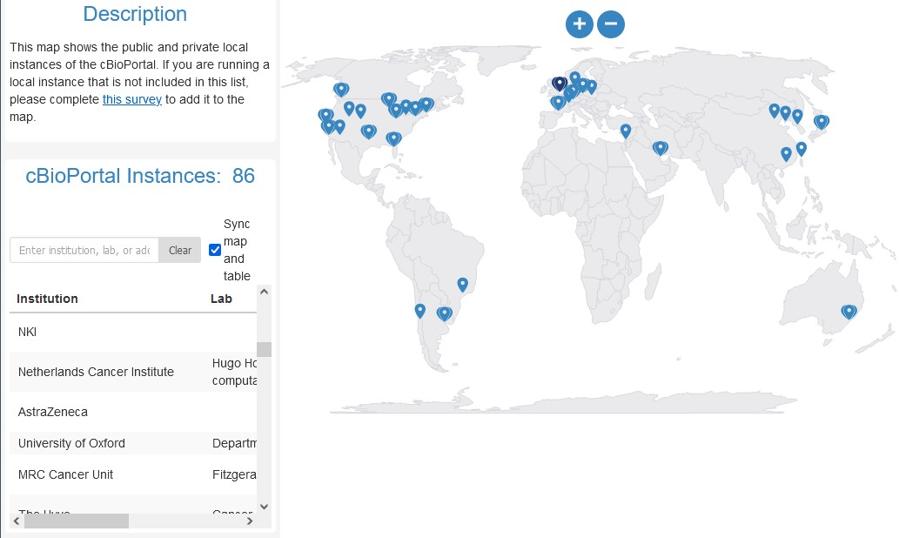

Thus, *Gustave Roussy* has deployed an internal local *cBioPortal*, meaning that the information is only available to Gustave Roussy employees when *connected to the GR_Intern network*: https://cbioportal.intra.igr.fr  
**By default, no study is available. You must make a request for access to the study of interest to the DAC, using [this form](https://forms.office.com/pages/responsepage.aspx?id=yEw7gfiljU2I0BddpylfA4ZOcK9TURpKkuTAq15dQ0VUOEtLNjY0N0JERFFYOVNCNFlXNE9YTjdLRy4u&origin=IprLink&route=shorturl).
Then, as soon as you have the green light from the DAC, you can contact the bioinformatics platform (bigr@gustaveroussy.fr) to obtain your access.  
To get the updated list of available studies, sent an email to bigr@gustaveroussy.fr.**  

For this practical, we will use the public cBioPortal https://www.cbioportal.org/, but the principle is the same with another instance of cBioPortal.  

# Extract cBioPortal information by the online interface

## Connexion

To use the interface go to the cBioPortal website: https://www.cbioportal.org/     

## Main interface

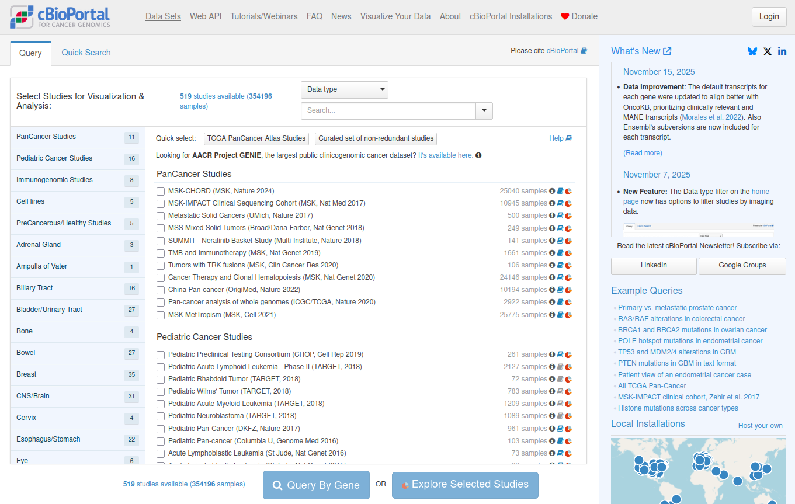

On the main page of the site we can see:  
- a menu bar at the top,  
- a request form at the center,  
- an insert on the right where the new features and some example queries are listed.  

The request form lists the studies from Gustave Roussy which are accessible via the cBioPortal.  
Currently 5 studies are available.  
We can see the name of the studies, followed by the number of samples for each study, the `i` logo gives a short description of the study, the book logo is a link to the publication, then the logo of the pie chart is a shortcut to the study summary page.  

## Data Sets tab

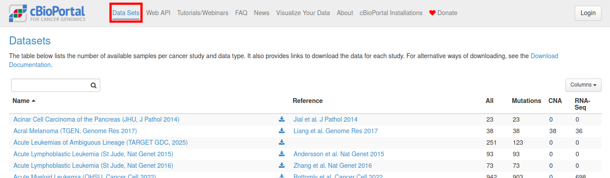

This tab lists the studies from Gustave Roussy which are accessible via the cBioPortal.  
These are the same studies as before.  
We can see the name of the studies, the link to the publication, the total number of samples, then the number of samples for each kind of data.  
Here we have "Mutations", "Copy Number Alteration" (CNA), and "RNA-seq" data.  

But if you click on the drop-down menu on the right, you can see the other types of data available.  
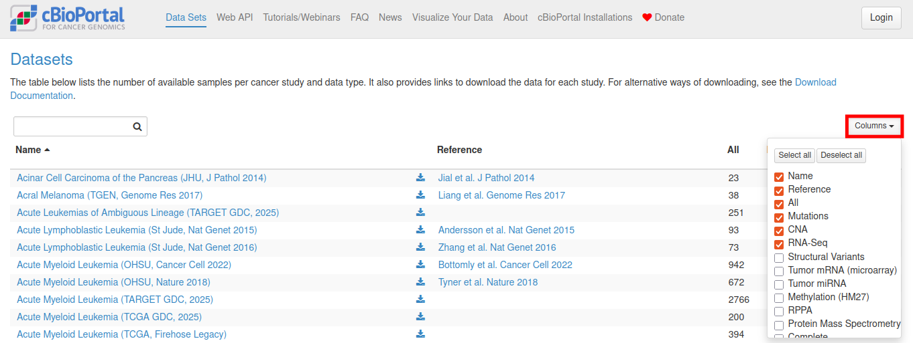


## Study selection

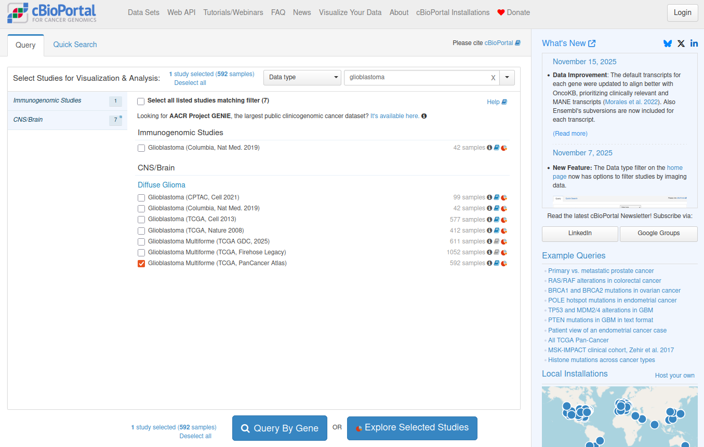

From the request form (click on cBioPortal logo to come back to the Main interface), we can either:  
- select a study of interest by clicking directly on the pie chart logo of the desired study line.  
- select one, several or all, studies by checking them, then click on the “Explore Selected Studies” button on the form.  

From the Data Sets tab, we can click on the name of the study of interest.  

Of course if there are too many studies available, you can use the keyword search form.  
Regardless of how you select your study of interest, you will be redirected to the same page.  
This new page contains a general banner at the top, displaying the name of the study (a small download icon to the right of the name allows you to download all the clinical and genomic data available for this study), the number of patients and the number of samples.  

The various additional tabs and buttons on this page are detailed below.  


## Summary tab

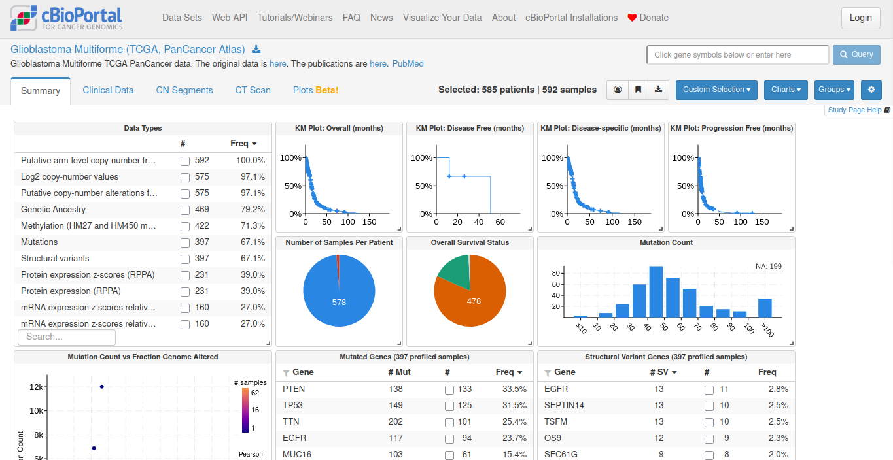


The summary tab allows you to summarize the data from the selected study in a few graphs and tables.  
This tab is made up of several elements that can be moved, enlarged (bottom right corner) or deleted.  
The elements are dynamic, that is to say that when you pass the mouse over them, displays can appear. Likewise, in the upper right corner of each element, a menu may appear offering several options (deletion of the element, download, additional information,...).  

### Tables

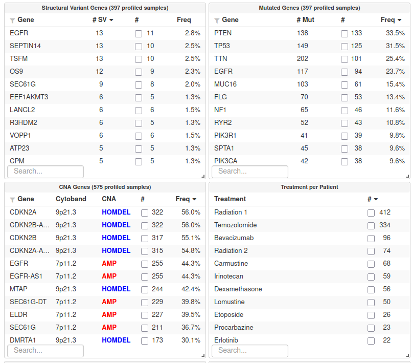


Tables have 3 main columns:  
-the first column: its name varies depending on the information listed in the table ("Molecular Profile", "Genes", "Categories", etc.).  
- the `#` column (for the `number`), corresponds to the number of samples with the characteristic of the first column.  
- the `Freq` column (for `Frequency`), corresponds to the percentage of samples with the characteristic of the first column.  

In some specific table instances we may have other additional columns:  
- `Mutated Genes` table:  
  - `# Mut`: total number of gene mutations. It may be higher than the number of samples with this mutation because one sample may have multiple mutations for this gene.  
- `Structural Variant Genes` table:  
  - `# SV`: total number of structural variants of the gene. Likewise, it may be higher than the number of samples with that structural variant because a sample may have multiple structural variants for that gene.  
- `CNA Genes` table:  
  - `Cytoband`: genomic region where the CNA is located (cytoband).  
  - `CNA`: the type of CNA (AMP: amplification; HOMDEL: homozygous deletion).  

> Note that you can filter the tables using the search bar at the bottom of the element, sort in alphabetical or numerical order if you click on the column names.

### Graphs

Several types of graphs are available to represent the data: pie charts, histograms, lineplots. or scateplots.  

Pie charts allow you to represent discrete data such as gender, ethnicity, number of samples per patient, sample type, etc.  

Histograms present continuous data such as age at diagnosis, fraction of altered genome, days to sample collection, etc.  

Lineplots present continuous data such as Overall survival, Kaplan-Meier of disease free, etc.  

Scaterplots compare 2 continuous data, such as the number of mutations as a function of the fraction of altered genome. This type of graph calculates a correlation score between the 2 variables compared (Spearman and Pearson), as well as the associated p-values.  

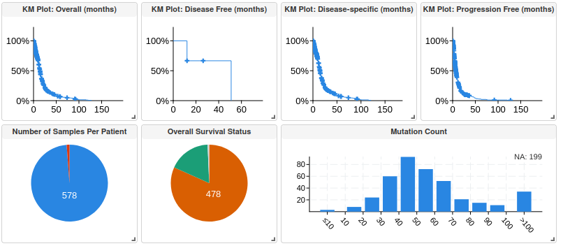

> Note that some graph displays the number of NA values. This is the number of samples for which we do not have the requested information.

### More graphes and tables

Not all tables and graphs are displayed by default.  
You can click on the `Charts` button at the top right, wander through the different menus ("Clinical", "Genomics"...) to add graphs and even test the `X to Y` to make scaterplots, boxplots and violinplots with variables of your choice.  

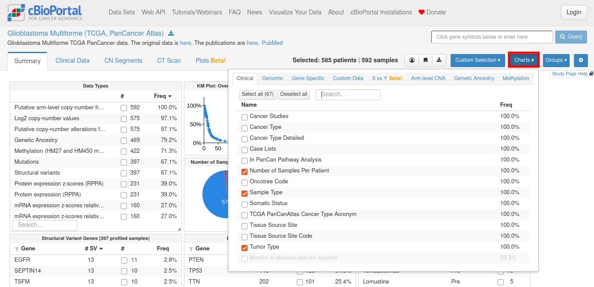

### Sample selection

To make a selection of samples you can click in the tables or in the additional displays given by the graphs when we hover our mouse over them.  

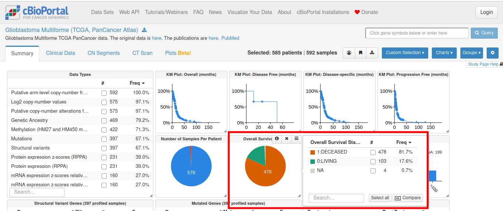

If you already have a list of patients or samples of interest you can use the "Custom Selection" button and put your list there.  

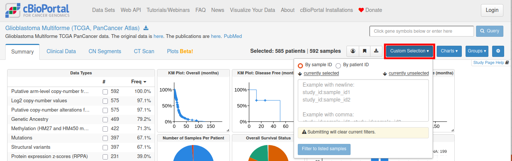


> Note that as soon as you have selected according to a criterion, all the tables/graphs are automatically updated to only present the information related to this selection.
> Of course you can select according to several criteria.


## Clinical Data tab

This tab presents the clinical characteristics of the patients/samples. The available columns depend on the studies.  


The `Charts` button in the Summary tab has become `Columns` and allows you to show or hide columns.  

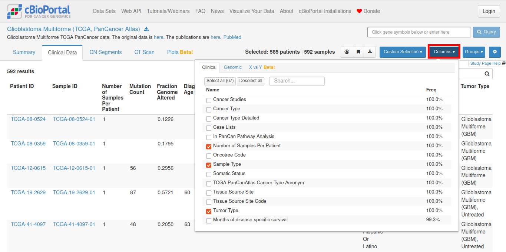

There is also a search bar and a download table button.  

This tab is up to date with the sample selections made previously.  

## Other tab

Other tabs may be available depending on the studies, for example in the study [Glioblastoma (TCGA, Cell 2013)](https://www.cbioportal.org/study/summary?id=gbm_tcga_pub2013).

In particular, the `Heatmap` tab which allows you to view heatmaps already made of the public cBioPortal). The menu on the left allows you to select a heatmap of interest among those proposed.

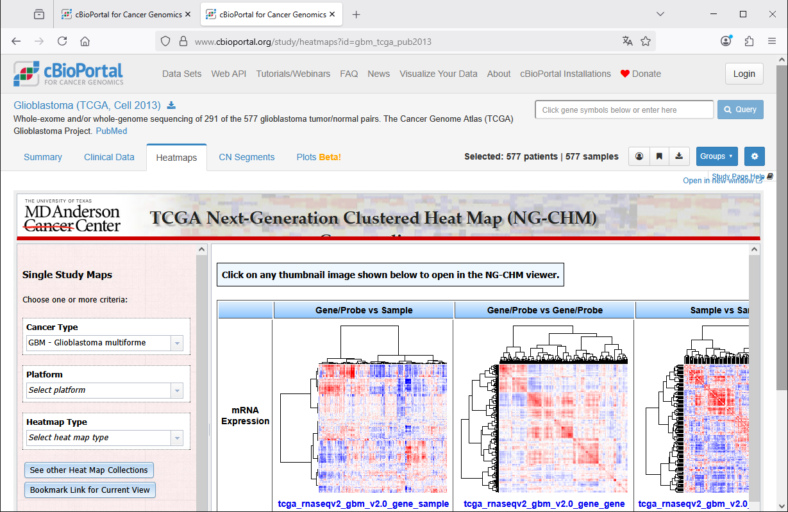

We can slightly customize these heatmaps by clicking on them which will redirect us to an editor. In this editor the left display ("Heat Map Detail") is a zoom of the complete heatmap ("Heat Map Summary") which is presented on the right. The verse element on the right heatmap corresponds to what we see on the left heatmap.

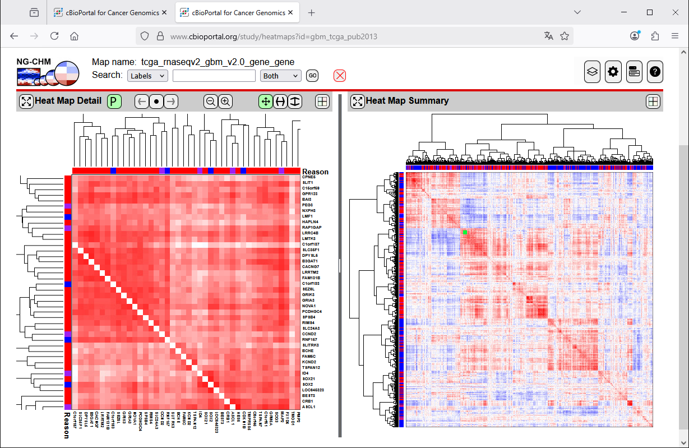

You can change certain heatmap parameters using the “Parameters” button.

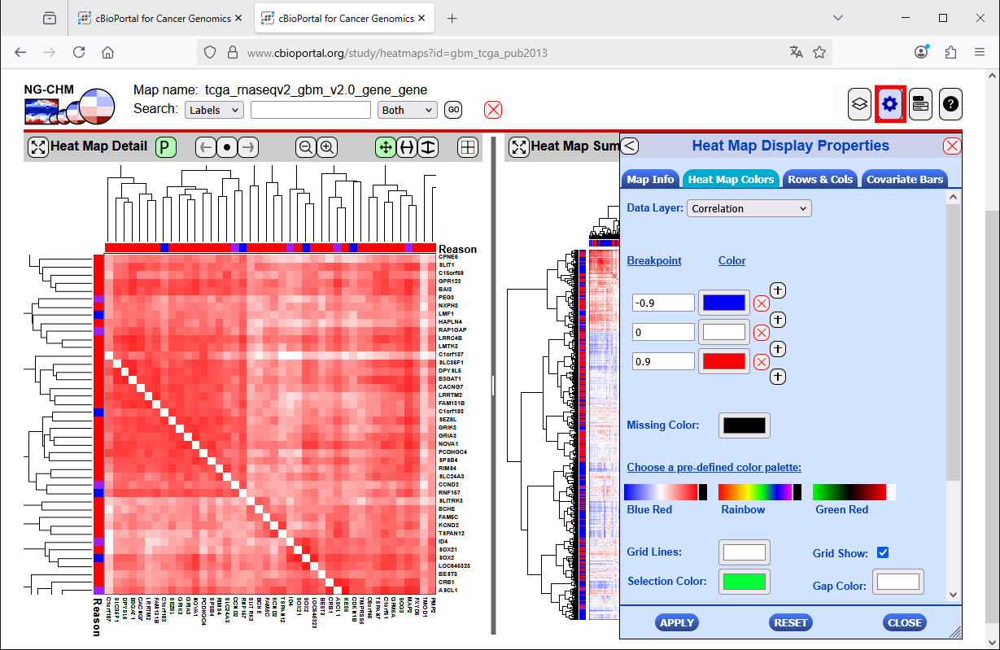


The "CN Segments" tab allows you to explore the copy number variations along the chromosomes with an IGV type display. The color represents the number of copies and each line corresponds to a patient. There are also settings buttons to display only a chromosome or a region, change colors, save the plot,...  

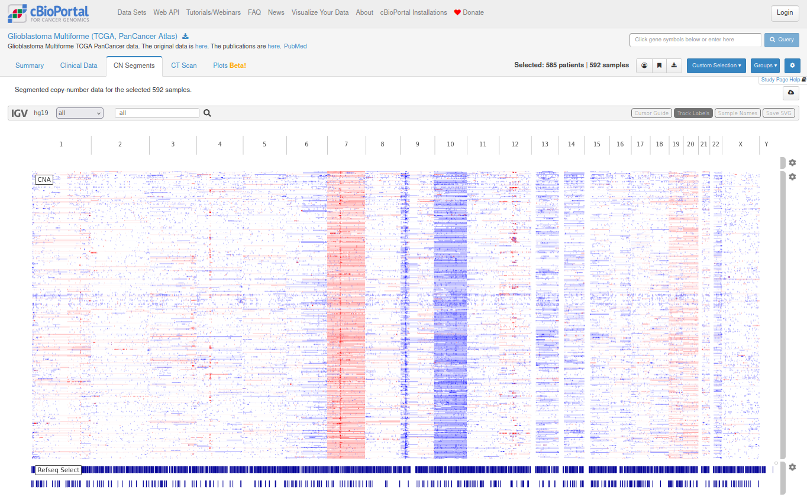

> You can zoom by double clicking.

And other tab types, including CT Scan, and probably others that I didn't come across while creating this course.  

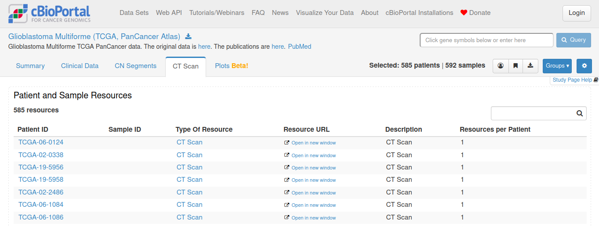

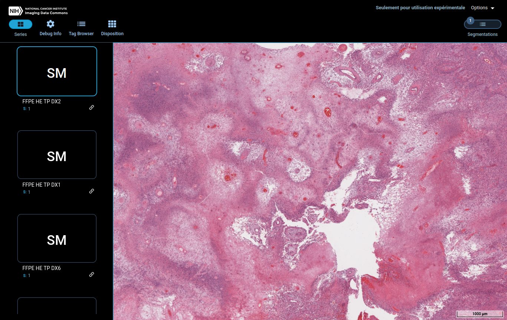

The “Beta Plots!” tab allows you to make your own comparison graphs of 2 variables, in a similar way with the `Charts` button of the "Summary" tab, but here we can also compare genomic data. The type of graph depends on the information to be compared.  

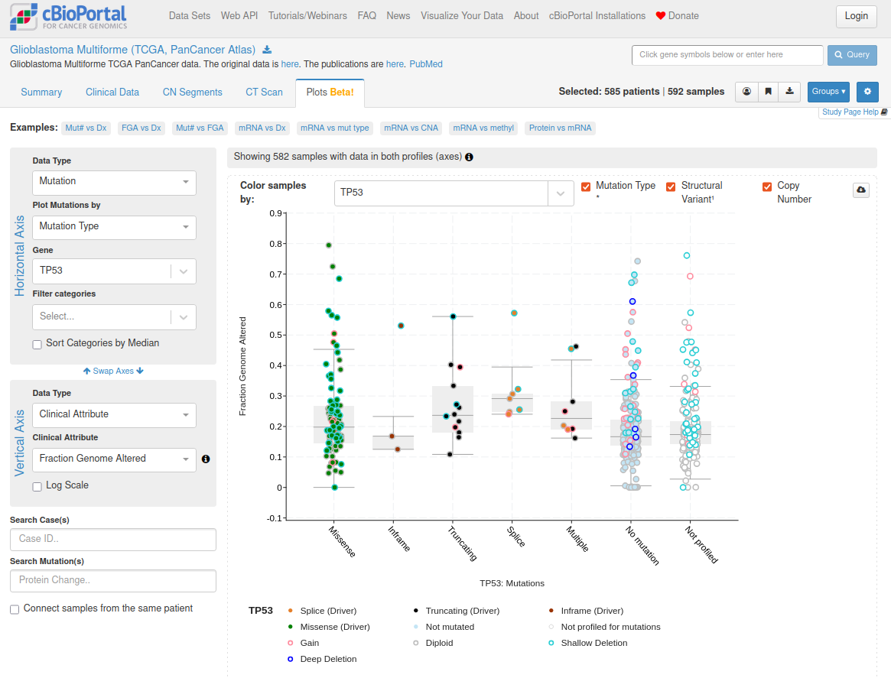


## Groups comparisons

Once you have selected your samples of interest, you can put them in a group with the `Groups` button which will save your selection. So you can make several groups.  
Group comparison allows you to compare their clinical and molecular characteristics.  

For example, return to the "Summary" tab, select all the "Male" and make them a group then do the same with the "Female".  

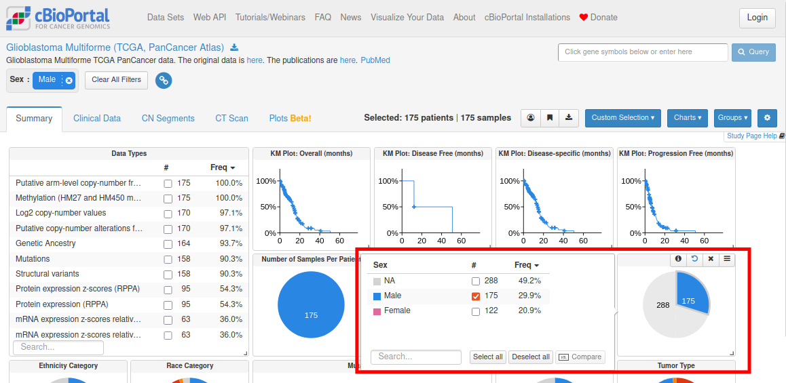


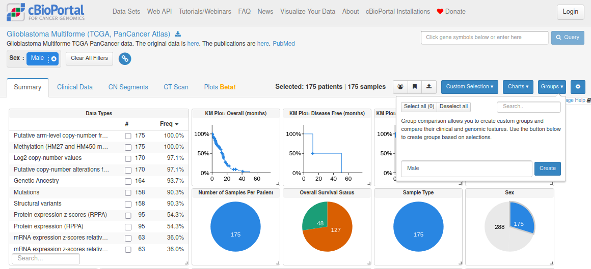

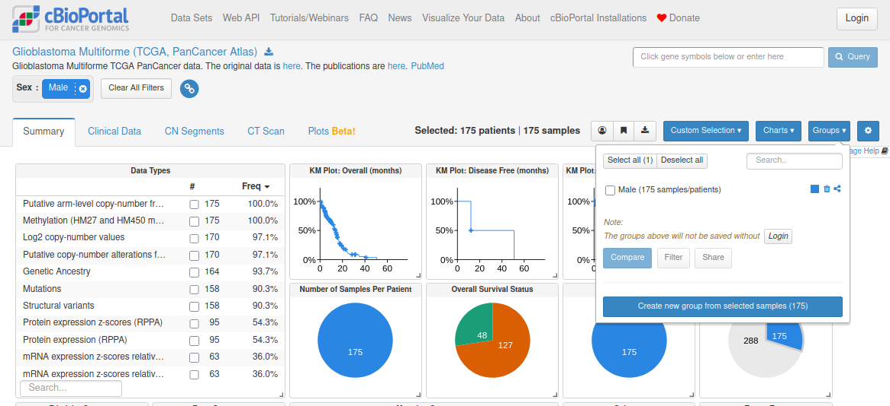

You see that our groups are displayed with a color (here pink for "Female" and blue for "Male").  
Then still in the `Groups` button, select the 2 groups that we have just made, then click on `Compare`.

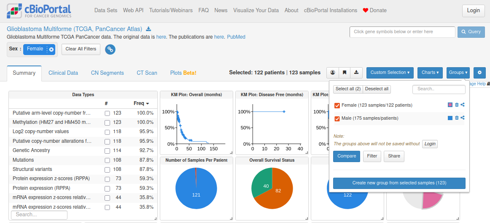


A new page opens with new tabs. The number and type of tabs depends on the availability of data from the selected studies.  

### Overlap tab

The "Overlap" tab allows you to know if you have patients or samples that are present in both groups at the same time (which can happen if you have made the selection on patients with several samples for example), thanks to a cubic Venn graph.  

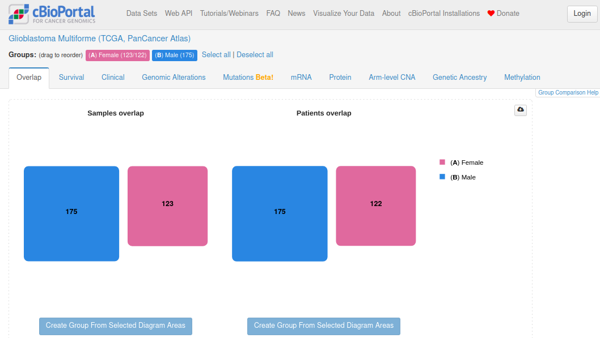

### Overall survival and Clinical tabs

The "Survival" tab compares the overall survival of the 2 groups with a Kaplan-Meier graph.  

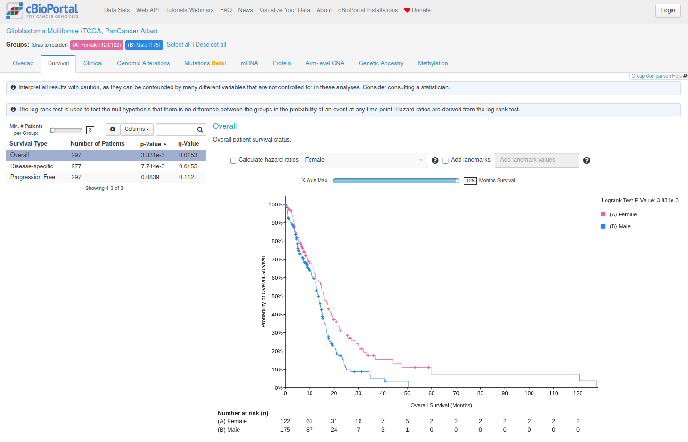


The clinical tab compares the clinical data between the 2 groups with appropriate statistical tests and presents graphs. Results are sorted by significance and significant results are in bold.  
As usual, you can select the columns to display, download the results table and graphs, search by word leader, change the graph display.  

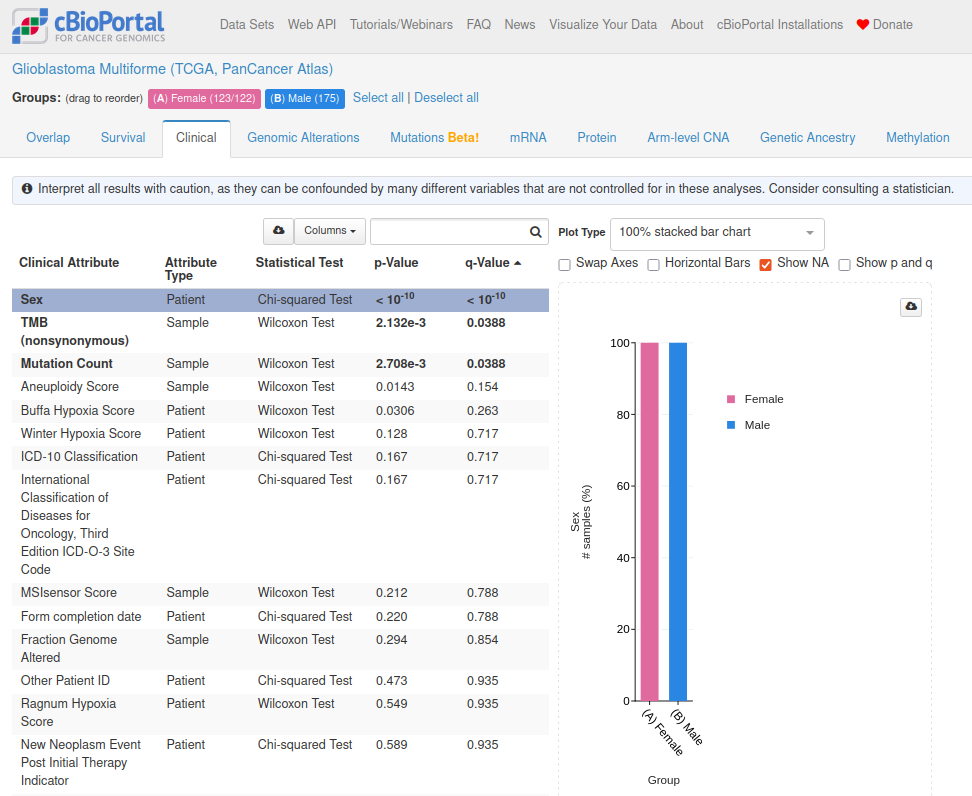

> Note: whether for the Survival or Clinical tab, there is a banner indicating that it is necessary to "Interpret all results with caution, as they can be confounded by many different variables that are not controlled for in these analyses. Consider consulting a statistician.". So the statistical tests carried out here can give us a first insight but it is better to discuss with a specialist before making any conclusions.

### Genomic Alteration tab

The "Genomic Alteration" tab allows you to compare mutations between the 2 groups, in particular the frequency of alteration overall or for certain genes. As usual, you have additional displays if you hover your mouse over the graphs, you can download the graphs and change which genes are displayed.  


At the bottom you have a comparison table for each alteration. If you hover over the column names you have explanations displayed, and you with the usual selection and save options.  

### Mutations Beta! tab

The “Beta Mutations!” tab allows you to compare the mutations between the 2 groups, by representing them along the protein domains. Mutations are represented above or below the protein axis depending on the group of patients to which they belong.  

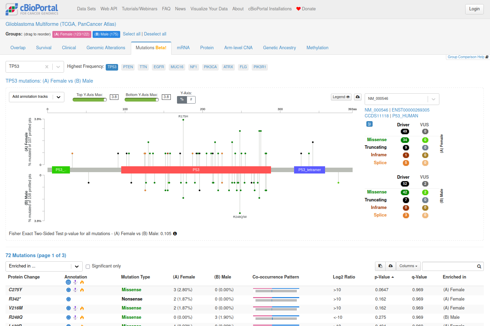

By default it offers you the proteins with the highest mutation frequency of their gene, but you can choose your protein/gene of interest. You can also display additional annotations by clicking on the "Add annotation Tracks" button (they are displayed at the bottom of the graph). You can view the legend by clicking the "Legend" button at the top right.  
Do not hesitate to hover your mouse over the graphic elements, the displays are dynamic.  
Similar to the "Genomic Alteration" tab, at the bottom you have a table which summarizes the protein changes and in which group it is enriched, with a score and significance. Note the presence of the "Annotation" column which gives you additional information from databases (OncoKB, CIViC,...).  

### mRNA, Protein, DNA Methylation tabs and other data

The "mRNA" tab allows you to carry out a differential expression analysis between our 2 groups. The graph displayed by default is a volcanoplot. There is also a table at the bottom with the results of the differential analysis. It is sorted by significance (q-Value) and significant genes are in bold.  
If we click on a gene in this table, a new graph appears with the expression levels in boxplot format.  

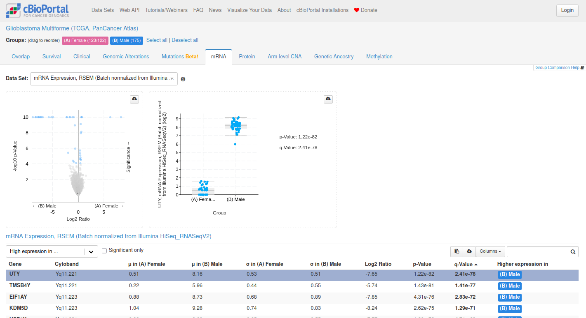

> Note if you hover over the name of the column named "p-Value", it indicates that the test used is a Student's t-test. This is a very good example of the fact that it is necessary to seek the advice of a statician before making the interpretation, because the use of a t-test requires having a lot of samples to compare and other statistical tests are more suitable.  

The “Protein” and “DNA Methylation” tabs are identical to the “mRNA” tab but for proteins or methylation.  

Other data can be available like Arm-level CNA or Genetic Ancestry, depending on the study.

## Search by genes

Instead of selecting the samples/patients, then doing the analyses/tables/graphs, then searching for your genes of interest in each analysis/table/graph, you can indicate your genes from the start and get results already filtered.  

To do this, we return to the very first page of the cBioPortal (by clicking on the logo at the top left of the page), we select the study (or studies) of interest, then we click on “Query By Gene”.  

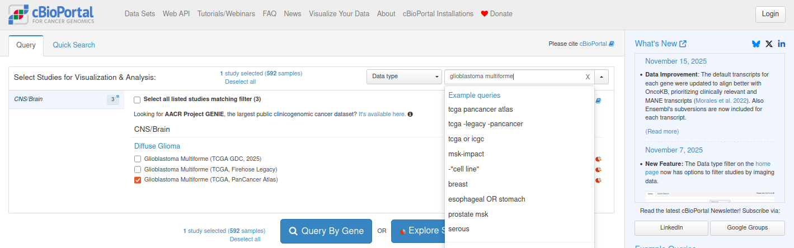

The rest of the form unfolds and you can choose the molecular data on which you want to work; then the patients/samples of interest, for example we keep all the samples or only those which have CNA data, or we can put our own list by choosing "User-defined Case List" and putting our list of IDs. Then, we write our genes of interest (separated by a comma if you want to put several), or we can also choose pre-defined lists of genes by clicking on the drop-down menu.  

Then we click on “Submit Query”.  

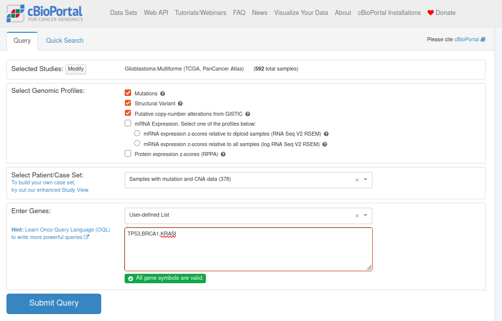

If you have a lot of samples, it may take a few minutes before the following page appears with multiple tabs.  
The number and type of tabs depends on the availability of data from the selected studies.  

### Oncoprint tab

The first result obtained is an oncoprint.  
This representation is widely used in publications analyzing patient cohorts because it allows a quick overview of the distribution of genetic alterations in the cohort.  
In this graph, each vertical line corresponds to a patient. Then, horizontally, we have their clinical data (different information depending on the study and modifiable with the “Tracks” drop-down menu), and the alteration information according to our genes of interest, with the percentage of patients with an alteration in these genes and the type of alteration.  
At the top of this table we have a banner with buttons for sorting, filtering and zooming in/out.  

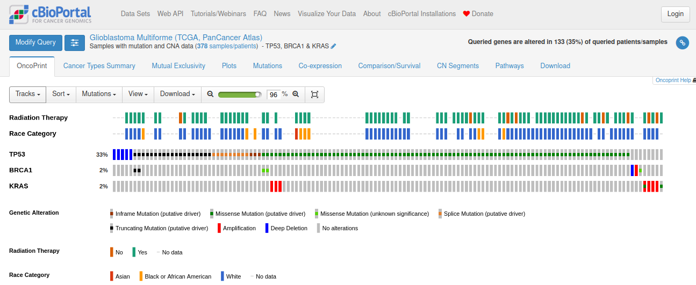

### Cancer Type Summary tab

This tab presents the same results but in the form of a cumulative histogram by type of cancer and by gene requested. You can choose the gene and cancer type level to plot with the options at the top of the graph.  

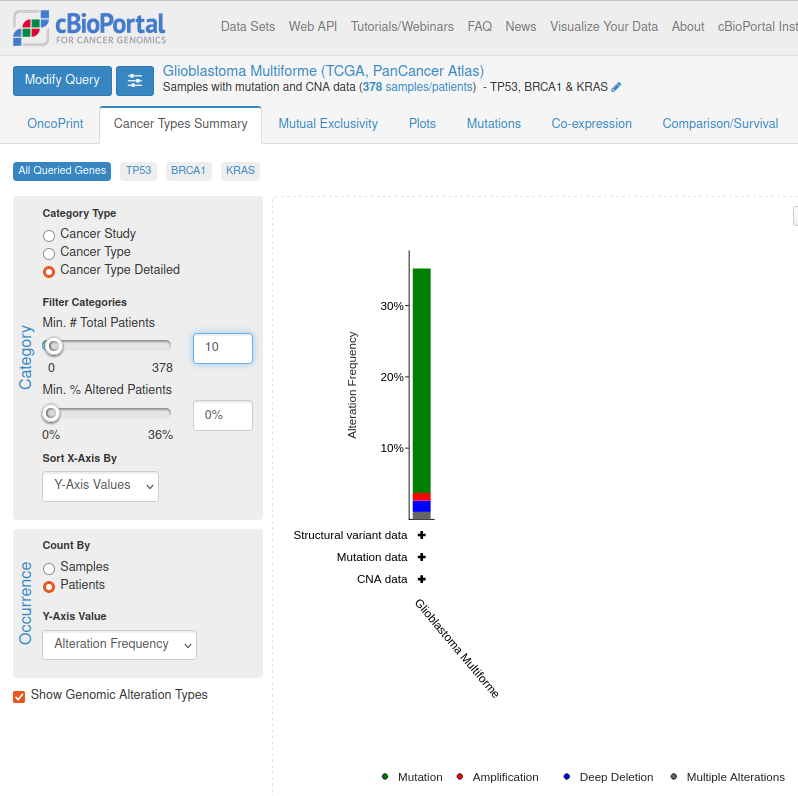


### Mutual Exclusivity tab

In this tab you can see if the genes in your list are linked. In other words, if one gene is mutated, is the other gene also often mutated ("Co-occurrence") or on the contrary it never is ("Mutual exclusivity").  
 
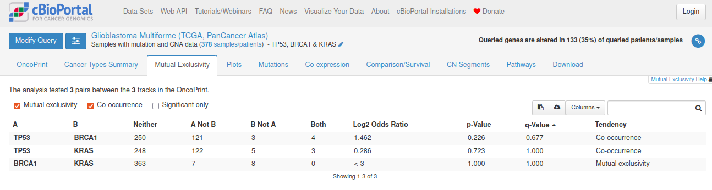

### Plots tab

In this tab we allow you to interactively generate graphs combining different types of data.  

For example, we can look at the expression of TP53 according to the type of Copy Number alteration of TP53, by coloring the TP53 alteration type.  

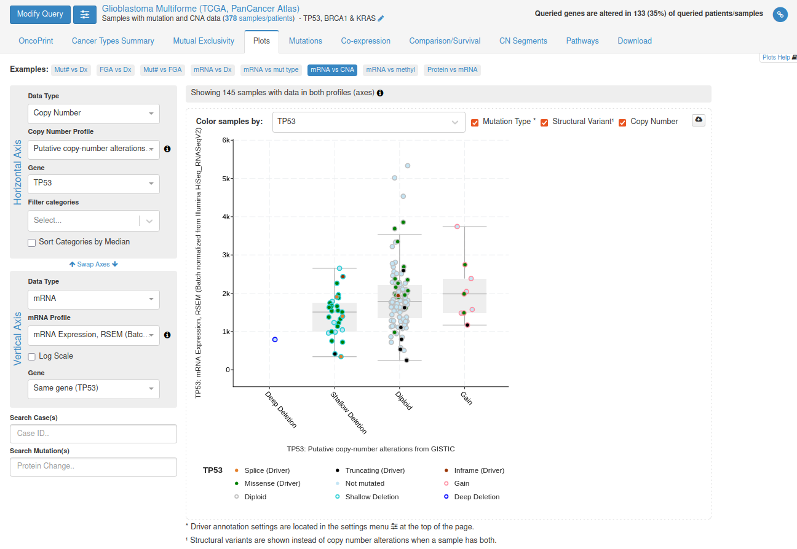

Or for example, we could look at the variation in the protein level of our gene depending on its gene expression level (RNA).  

### Mutations tab

This tab corresponds to the tab named “Beta Mutations!” obtained when comparing several groups (except that here we have no comparison). We have the graph of the distribution of mutations along the proteins of our genes of interest, with the corresponding table.  

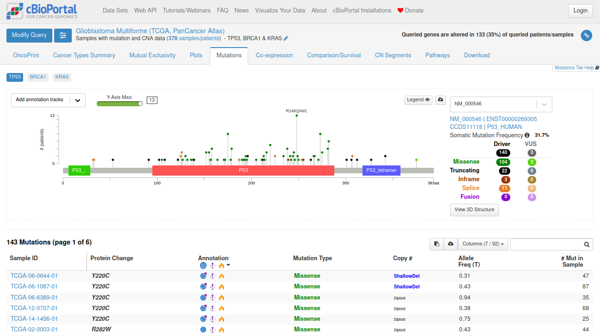

### Co-Expression tab

The "Co-Expression" tab allows us to know if our genes of interest have genes that are co-expressed with it, in other words, genes whose expression evolves in a similar way across patients.  
The results are in tabular form with all genes tested, the most significant at the top. We can also plot a scatterplot of the expression of the 2 genes and a correlation score is calculated. If the mutation status is available the points are colored according to this status.  

Example with the Glioblastoma Multiforme study (TCGA GDC, 2025) on the public cBioPortal:

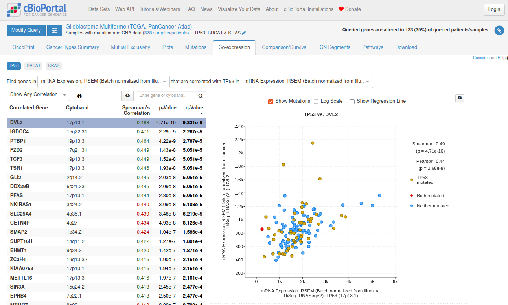

### Comparison/Survival tab

This tab itself has several tabs, which are the same as when we compared the 2 groups of samples previously (Overlap, Survival, Clinical, Genomic Alterations, mRNA, Protein, DNA Methylation,...), but here to compare the samples with at least one alteration of our genes of interest against the samples without alteration.   
You can also change the groups to compare:  
- samples with at least one alteration among all our genes of interest,  
- samples without any alteration among our genes of interest,  
- samples with at least one alteration in a chosen gene.  

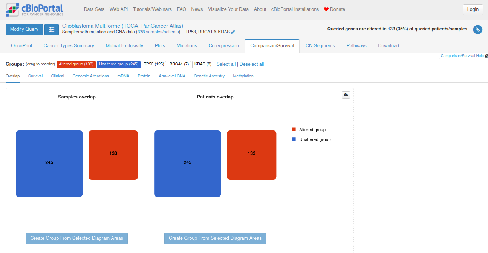


### CN Segments tab

The graphs are the same as for the "CN Segments" tab seen previously, but here we have buttons for each of our genes to go directly to their genomic regions more easily.  

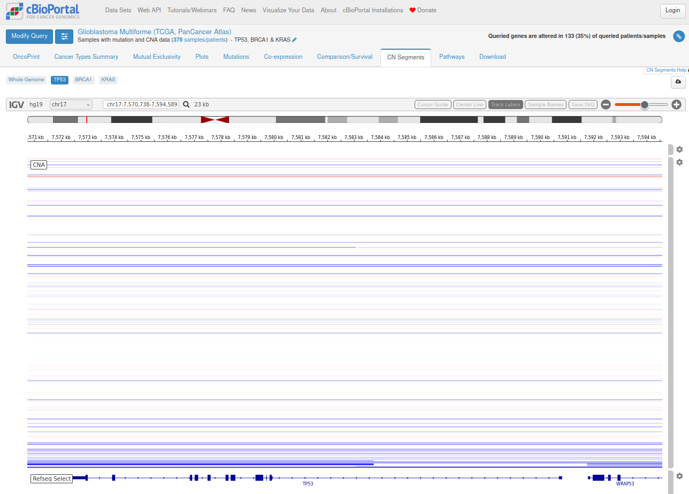

### Pathways tab

This tab allows us to display the signaling pathways of our genes of interest.  
There are 2 pathway databases available and each has its own viewer:  

- PathwayMapper shows pathways from over fifty cancer related pathways and provides a collaborative web-based editor for creating new ones.  
It displays network signaling pathways as well as the frequency of alteration of genes present in these pathways (if the information is available).  
On the right is the table of results with all the signaling pathways identified (sometimes you can have several pathways for a single gene).   
>Please note if the "Show TCGA PanCancer Atlas pathways only" option is checked then only the pathways presented in the TCGA PanCancer Atlas pathways will be shown (and not all the pathways in PathwayMapper).  
>Note that you can move the pathway bricks to arrange them wherever you want.  

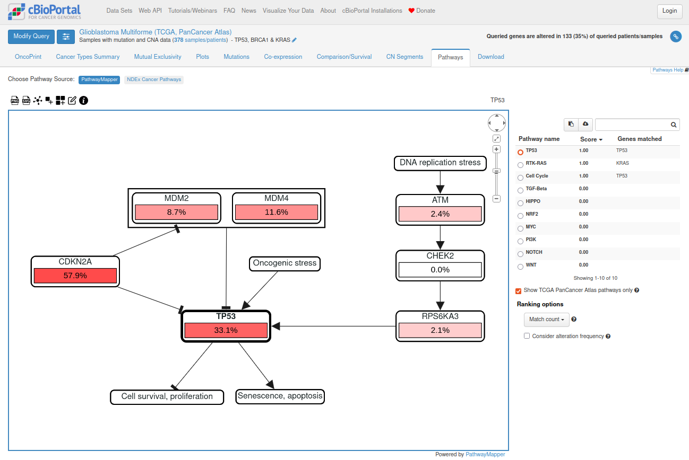

- NDEx shows 1,352 pathways by aggregating several other databases: NCI-PID, Signor, WikiPathways, CPTAC, CCMI and NeST. Here we have the list of signaling pathway on the left and their display on the right.  
The display and legend are different depending on channels because they depend on the database used. But our genes of interest are always boxed in pink.  
You can click on the name of the pathway (in the title displayed in blue) to get information on it, as well as on the genes (nodes) and the links between genes (edges). But the graphs are also dynamic so we can get this information by clicking on the genes or on the links between the genes directly.  

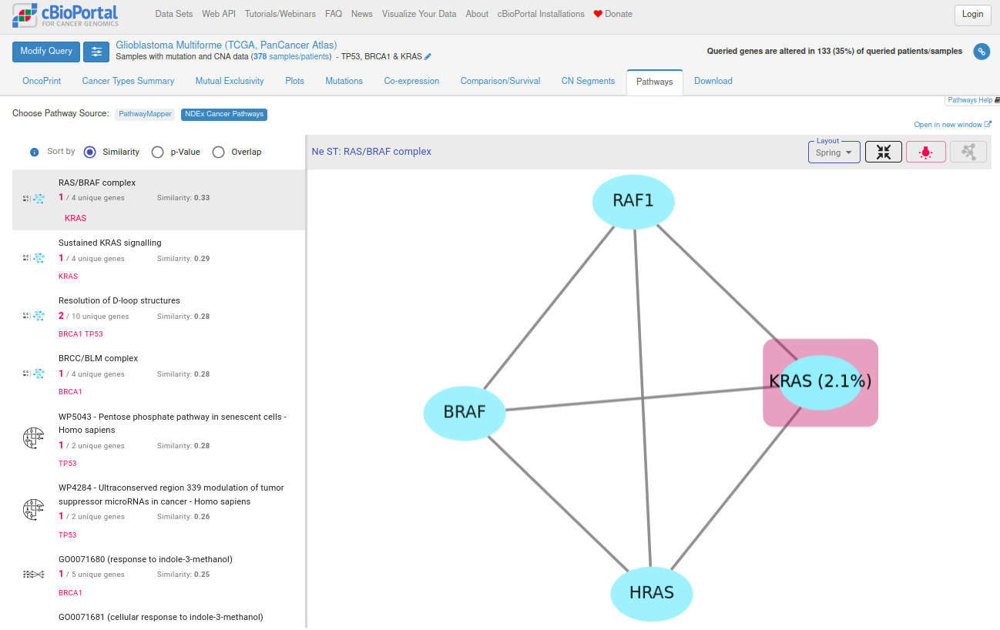

### Download tab

On the public cBioPortal only, this tab allows you to download all the clinical and genomic data from the samples selected according to our genes of interest.  

## Make graphs on your own data?

Another interesting feature of cBioPortail is to visualize your own data.
You can do:
- the oncoprint.
- the mutationmapper.

To do this, click on the “Visualize Your Data” tab (at the very top of the page), then on “OncoPrinter” or “MutationMapper”.

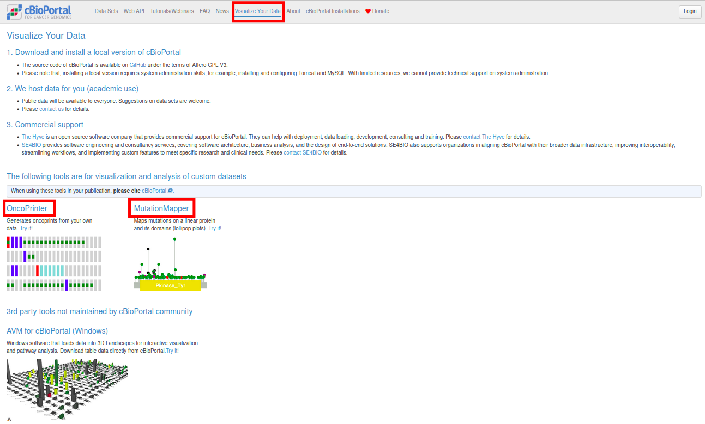


Please note, all data must be anonymized before upload.

### Oncoprint

This allows you to make the same encoprint as seen previously.
You can copy and paste your tables directly into the corresponding areas or load them via a file.
To get an idea of the format you can click on "Load example data" and/or for an explanation of the format on "View data format".
You can put genomic, ~~clinical~~ and/or heatmap information.
Once the information has been entered, you can optionally choose an order of appearance of the genes or samples on the graph; and click on “Submit”.

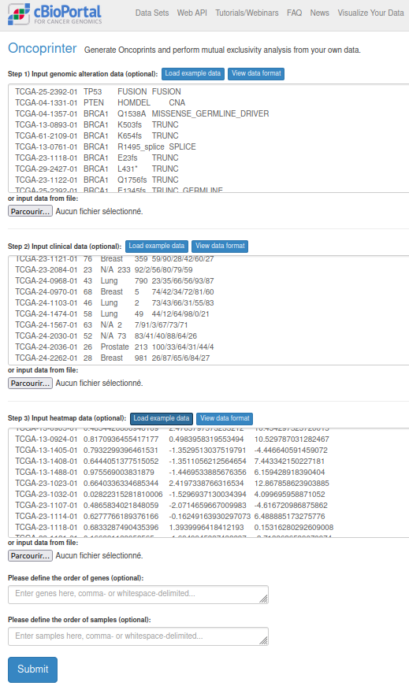


The oncoplot appears (with genomic information, then ~~clinical~~, then heatmap) as well as a Mutual Exclusivity analysis.

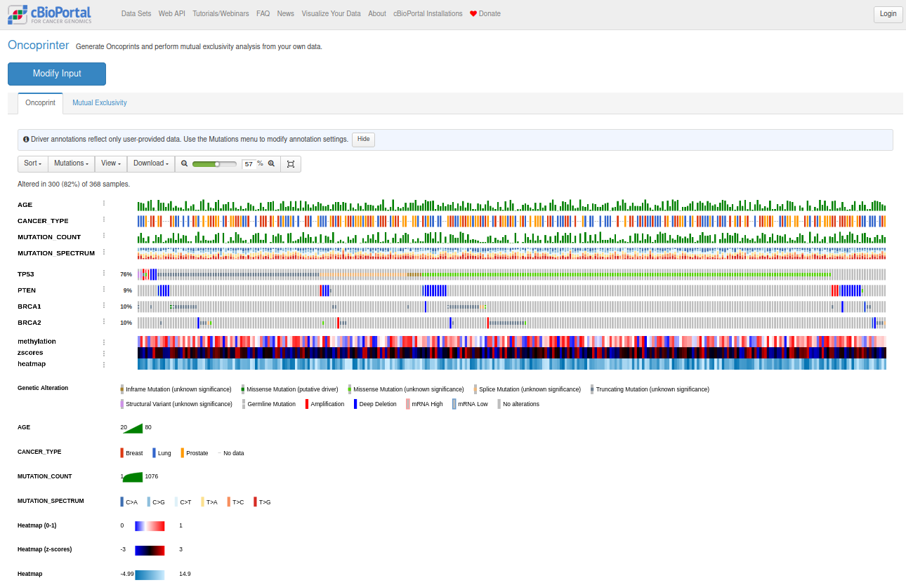

### Mutationmapper

This allows you to create a graph representing mutations along protein domains.  
You choose your reference genome (the one used for your analysis), then enter your analysis data.  
To see the expected format, you can click on one of the examples given in "Load example data" and/or for an explanation of the format, click on "Data format".  

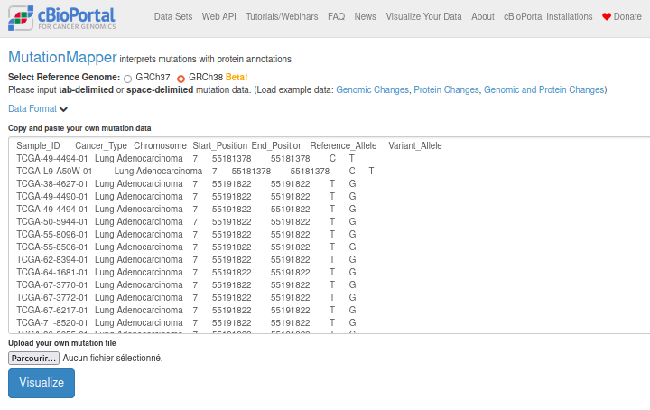

Then click on "Visualize".

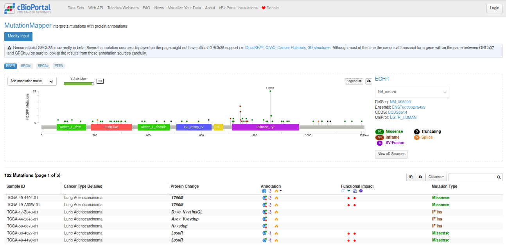

## Save your session

To store your virtual studies and groups you can sign in with your Google or Microsoft account on public cBioPortal (similarly with your Gustave Roussy account on the Gustave Roussy cBioPortal). This will allow you to access your studies and groups from any computer, and cBioPortal will also remember your study view charts preferences for each study (i.e. order of the charts, type of charts and visibility).  
Login is optional on the public cBioPortal and not required to access any of the other features of cBioPortal.  

Also, you can share your patient selection by creating a web link to your selection.
Click on the "Save/Share Virtual Study" button, then give a name to you selection, then click on "Save" or "Share".  

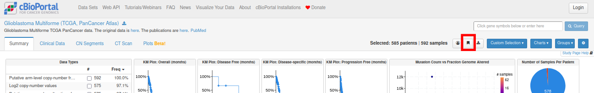
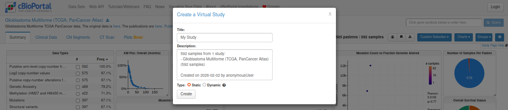
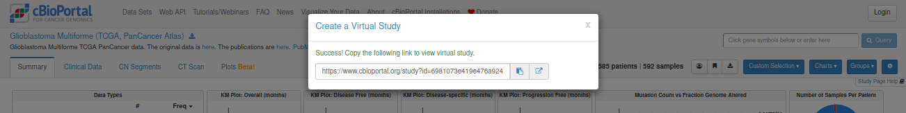
You can save the link to your virtutal study, to share it with your colleagues.  

Also if you come back to the very first page of the cBioPortal (by clicking on the logo at the top left of the page), you can see your new virtutal study.  

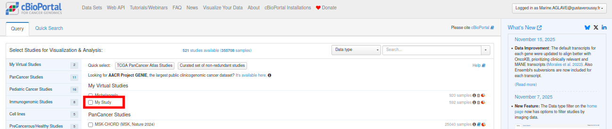


# Extract cBioPortal information by R

But what about reproducibility of you research on this web site? Do you remember each button you clicked, especially for study selection and sample/patient selection?  
The easiest way is to make an R script.  

There are 2 R packages that allow you to retrieve data from cBioPortal: [`cbioportalR`](https://www.karissawhiting.com/cbioportalR/index.html) and [`cBioPortalData`](https://www.bioconductor.org/packages/release/bioc/vignettes/cBioPortalData/inst/doc/cBioPortalData.html).
Unfortunately, neither of these 2 packages allows you to recover all the data in an easily analyzable format, nor to create graphs (the graphs will have to be created by yourself).  

`cbioportalR` allows to retrieve data in easily filterable data.frame format but only clinical data, mutations, copy numbers (with segments) and structural variants. Basically, it does not recover gene expression, methylation, protein levels, etc. In addition, it only provides dataframes that are not linked together, so if we filter the mutation table to only keep certain patients (for example), we must filter the clinical data accordingly on the same set of patients.  

[`cBioPortalData`](https://www.bioconductor.org/packages/release/bioc/vignettes/cBioPortalData/inst/doc/cBioPortalData.html) allows you to retrieve data in a complex format called MultiAssayExperiment which is an assembly of several other objects of type SummarizedExperiment and RaggedExperiment. This assembly makes it possible to link clinical data to experimental data, and to filter everything in a single block (so we can filter clinical and experimental data at the same time). In my experience, only structural variant data is not retrieved with this package, however, it heavily filters the available information. For example, for mutations, it only loads the position of the mutation (for each mutated gene for each sample) but we no longer have the information concerning the mutated nucleotide (A?T?C?G?), the number of mutated and normal reads (so it is impossible to compute the VAF), nor any annotation (missens? impact on the protein? already known from the annotation databases (COSMIC...)?).  

*Welcome to the real deep world of bioinformatics. Everything is not always obvious, but we always end up finding a solution with a little agility and imagination.*

> The shortcomings of these two packages are probably due to the file formats which can be formatted differently depending on the studies. For example for rna, there can be several versions of expression tables: raw counts, in log2, in zscore, or even by gene or by transcript.  
Limitations are also attributable to the API (application programming interface) created by the cBioPortal team. An API is an additional functionality of websites allowing information to be retrieved from the site using the command line. So these packages will query the website via the API, but if the API characteristics are limited, the packages will be limited too.

For this course, we suggest using the `cbioportalR` package. The results will be in a dataframe format, easy to filter with functions dedicated to dataframes.  

I strongly advise you to have understood the courses on [Tables Manipulations](https://github.com/gustaveroussy/training_bigr/blob/main/Tables_manipulation/For_Students/Tables_manipulation.html) and the one on [Making graphs with ggplot2](https://github.com/gustaveroussy/training_bigr/blob/main/Make_graphs_under_R_with_ggplot2/For_Students/Make_graphs_under_R_with_ggplot2.html). We will consider their content as acquired for the rest of this course.  


## Setup environment and token

We load `cbioportalR` R package to get data, and dplyr/tidyr R packages to manipulate data.

```{r, eval=FALSE}
# Installation
install.packages("cbioportalR")
```

```{r}
#Loading library
library(cbioportalR)
library(dplyr)
library(tidyr)
```


Before accessing data you will need to connect to a cBioPortal database and set your base URL for the R session.

### For the Gustave Roussy cBioPortal

If you want to use the Gustave Roussy cBioPortal, you need to connect you to the GR_Intern network and establish the connection between your R and the intern cBioPortal.
For this last point, you need to add a token to your ~/.Renviron file to authorize access:

1. Go on the cBioPortal interface (https://cbioportal.intra.igr.fr), then retrieve your token (top right):

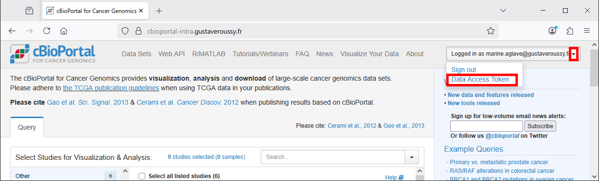


1. Modify your R environment by editing the ~/.Renviron file to add a new variable like:  
CBIOPORTAL_TOKEN = 'YOUR_TOKEN'  
```{r, eval=FALSE}
#To open the file ~/.Renviron
usethis::edit_r_environ()
```

1. Then connect you to "cbioportal.intra.igr.fr" with the `set_cbioportal_db()` function:
```{r, eval=FALSE}
base_url <- "cbioportal.intra.igr.fr"
set_cbioportal_db(base_url)
```
**Token is valid for 30 days. After this time it will be necessary to regenerate it.**


### For the public cBioPortal

If you want to use the public cBioPortal database instance (https://www.cbioportal.org), you do not need a token to access this public website, and just connect you to "https://www.cbioportal.org" base url with the `set_cbioportal_db()` function:
```{r, eval=TRUE}
base_url <- "https://www.cbioportal.org"
set_cbioportal_db(base_url)
```

In the rest of the course we will use the public cBioPortal database instance, but everything works similarly for the Gustave Roussy cBioPortal.  

## Identifying available studies

Now that we are successfully connected, we may want to view available studies for our chosen database to find the correct study_id corresponding to the data we want to pull.
You can view all studies available in your database with the following:
```{r}
studies <- available_studies()
head(studies)
```
We get several pieces of information such as the name of the studies, their description, their publication, the date of import, the number of samples,...  

The number of available studies:  
```{r}
nrow(studies)
```
Hum, only 50 studies? That not a lot! Where are the ~500 studies presented on the web site?  
This is a limitation of the API, it returns only the last 50 studies by default.  
Unfortunately the cBioPortal package does not offer a solution, so we will have to code that by hand. I'm giving the code to you ready-made, no need to understand it in detail, that's not the subject of the course here.  

```{r}
#load packages
library(httr) #to send HTTP requests to the API
library(jsonlite) #to convert JSON responses to R objects

#cBioPortal API base address
studies_url <- paste0(base_url, "/api/studies")

#send a GET request to the API
res <- GET(
    studies_url,
    query = list(
      pageSize = 1000, # 1000 studies requested (there are ~500 studies, so that's sufficient for this database)
      pageNumber = 0   # the first page
    ),
    accept_json()     # request JSON format
  )
#format into data.frame
all_studies <- fromJSON(content(res, "text", encoding = "UTF-8"))
#print the first lines of the data.frame
head(all_studies)
#print the number of rows of the data.frame
nrow(all_studies)
```

Great! Now there are over 500 studies available!  

We can plot the top 20 of cancerTypeId with the largest number of studies:
```{r}

library(ggplot2)

#get the top 20 cancer types
top_cancers <- all_studies %>%
  count(cancerTypeId) %>%
  top_n(20, n)

#plot
ggplot(top_cancers, aes(x = reorder(cancerTypeId, n), y = n)) +
  geom_bar(stat = "identity", fill = "steelblue") +
  coord_flip() +  # flip axes for readability
  labs(
    title = "Number of Studies per Cancer Type",
    x = "Cancer Type",
    y = "Number of Studies"
  ) +
  theme_classic()

```


## Choose your study of interest

If we want to search for all studies related to glioblastoma (a.k.a. that have the term "glioblastoma" in their name):
```{r}
as.data.frame(subset(all_studies, grepl("glioblastoma", all_studies$name, ignore.case = TRUE)))
```
> Note: grepl is a function that allows you to search for one or more words in a vector. It returns a logical vector (TRUE/FALSE) which is given to the subset function which will make the selection in the table. In addition, we ignore the case because in computing upper/lower case letters are discriminatory by default ("Glioblastoma" is different from "glioblastoma").

For the example, we choose the study named “Glioblastoma Multiforme (TCGA, PanCancer Atlas)”, whose identifier is “gbm_tcga_pan_can_atlas_2018”:


```{r}
study_id <- "gbm_tcga_pan_can_atlas_2018"
```

To get more information on our studies, we can do the following:
```{r}
study_info <- get_study_info(study_id) %>% t()
study_info
```

To view the list of data available in this study:

```{r}
study_profiles <- available_profiles(study_id) %>% as.data.frame()
study_profiles
```

## Download data

Now that we have chosen our study we will be able to download its data.

### Get clinical data

```{r}
#get the list of all available samples
sampleList <- available_samples(study_id = study_id)

#get clinical data from the list of available samples
clinical_data <- get_clinical_by_sample(sample_id = sampleList$sampleId,
                                        study_id  = study_id)
#format to get one line per patient
clinical_data <- clinical_data %>% pivot_wider(names_from = "clinicalAttributeId") %>% as.data.frame()

#print first lines
head(clinical_data)
 
```


### Get molecular data

As said above the cbioportalR R package provides functions to download mutations, cna (with segments), and structural variants data only.  
You can use the `get_mutations_by_study()`, the `get_cna_by_study()`, `get_segments_by_study()` or the `get_fusions_by_study()` functions to get mutations, cna, segments, and structural variants data respectively:  
```{r}
mutation_data <- get_mutations_by_study(study_id = study_id)
cna_data <- get_cna_by_study(study_id = study_id)
SV_data <- get_fusions_by_study(study_id = study_id)
segment_data <- get_segments_by_study(study_id = study_id)
```

## Work on downloaded data (merge, filtering, format, ...)

To filter molecular data according to clinical data, we have 2 strategies:
- either merge the molecular and clinical data, then do the filter,
- either filter the clinical data, then filter the molecular data according to the clinical data.

In both cases, you need to know how to filter and merge the data.

### Filtering

#### Clinical data

Example to keep "Primary" tumor clinical data:
```{r}
#prepare
head(clinical_data)
colnames(clinical_data) # name of the columns on which we can filter

#filtering to keep "Primary" tumor clinical data
clinical_data_primary <- clinical_data[clinical_data$SAMPLE_TYPE == "Primary", ]

```

#### Genomic data

Example to keep "BRCA" mutated samples:
```{r}
#prepare
head(mutation_data)
colnames(mutation_data) # name of the columns on which we can filter

#keep sample with a mutation into BRCA1 
BRCA1_mutation_data <- mutation_data[mutation_data$hugoGeneSymbol == "BRCA1", ]
```

CNA, SV and segment data can be filtered in the same way.


#### Filter molecular table following clinical table

"uniqueSampleKey" is the unique ID of each sample. So it is the best column to make a correspondence between clinical and data.  

Genomic data example: get the mutation data with a mutation on BRCA1 for patients with Priary tumor:  
```{r}
#keep sample with a mutation into BRCA1 
BRCA1_mutation_data <- mutation_data[mutation_data$hugoGeneSymbol == "BRCA1", ]
#keep "Primary" tumor clinical data
clinical_data_primary <- clinical_data[clinical_data$SAMPLE_TYPE == "Primary", ]
#filtering
BRCA1_mutation_data_filtered <- BRCA1_mutation_data[BRCA1_mutation_data$uniqueSampleKey %in% clinical_data_primary$uniqueSampleKey,]

```

Genomic data example: get the mutation data for patients with an altered genome fraction greater than 0.2:
```{r}
#convert into numeric
class(clinical_data_primary$FRACTION_GENOME_ALTERED)
clinical_data_primary$FRACTION_GENOME_ALTERED <- as.numeric(clinical_data_primary$FRACTION_GENOME_ALTERED)
class(clinical_data_primary$FRACTION_GENOME_ALTERED)

#check values
summary(clinical_data_primary$FRACTION_GENOME_ALTERED) #there are some NA values

#get patient ID with an altered genome fraction greater than 0.2
clinical_data_high_alter <- clinical_data[ !is.na(clinical_data$FRACTION_GENOME_ALTERED) & clinical_data$FRACTION_GENOME_ALTERED > 0.2,]

#filtering
mutation_data_filtered <- mutation_data[mutation_data$uniqueSampleKey %in% clinical_data_high_alter$uniqueSampleKey,]

```


### Merge clinical and molecular data

```{r}
#genomic data
mut_clin <- merge(clinical_data, mutation_data, all = TRUE) %>% as.data.frame()
head(mut_clin)
```

> Note: by default, merge merges by common column names between the 2 dataframes. `all` allows to keep all row from both dataframes, if you want to keep only all row from mutation_data but not from clinical_data, set `all.y = TRUE, all = FALSE` (for the opposite put `all.x = TRUE, all = FALSE`).

# Citation

If you use cBioPortal in your reseach don't forget to cite them:
- Cerami et al. The cBio Cancer Genomics Portal: An Open Platform for Exploring Multidimensional Cancer Genomics Data. Cancer Discovery. May 2012 2; 401. PubMed.https://pubmed.ncbi.nlm.nih.gov/22588877/
- Gao et al. Integrative analysis of complex cancer genomics and clinical profiles using the cBioPortal. Sci. Signal. 6, pl1 (2013). PubMed. https://pubmed.ncbi.nlm.nih.gov/23550210/
- de Bruijn et al. Analysis and Visualization of Longitudinal Genomic and Clinical Data from the AACR Project GENIE Biopharma Collaborative in cBioPortal. Cancer Res (2023). PubMed. https://pubmed.ncbi.nlm.nih.gov/37668528/

Remember also to cite the source of the data if you are using a publicly available dataset.

# Ressources

For more information, please read :  
cBioPortal FAQ: https://docs.cbioportal.org/user-guide/faq  
cBioPortail tutorials: https://docs.cbioportal.org/user-guide/overview/  
Script R:
- https://www.karissawhiting.com/cbioportalR/articles/overview-of-workflow.html  
- https://cran.r-project.org/web/packages/cbioportalR/readme/README.html  
